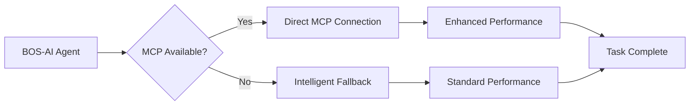

# BOS-AI: Business Operating System with AI Agent Suite
## Transforming Solopreneur Excellence Through Systematic AI-Augmented Operations


> **📚 Need Help?** Check [Troubleshooting](#-troubleshooting--faq) | [Requirements](#-system-requirements) | [Documentation](CLAUDE.md)

---

## 🚀 Quick Start - One-Line Installation

### Step 1: Open Terminal in Your Project
```bash
# Navigate to your business project directory
cd ~/your-business-project
```

### Step 2: Install BOS-AI with MCP Support (Choose Your Tier)

#### 🚀 NEW: Enhanced Installation with MCP Integration
```bash
# Install with automatic MCP configuration (Recommended)
curl -fsSL https://raw.githubusercontent.com/TheWayWithin/BOS-AI/main/deployment/scripts/install-with-mcp.sh | bash -s full
```
**Includes:** All 30 agents + automatic MCP detection + intelligent fallbacks

#### Option A: Starter Tier (5 Essential Agents)
```bash
curl -fsSL https://raw.githubusercontent.com/TheWayWithin/BOS-AI/main/deployment/scripts/install.sh | bash -s starter
```
**Perfect for:** Getting started, small businesses, testing the system

#### Option B: Business Tier (15 Core Agents)
```bash
curl -fsSL https://raw.githubusercontent.com/TheWayWithin/BOS-AI/main/deployment/scripts/install.sh | bash -s business
```
**Perfect for:** Growing businesses, comprehensive operations

#### Option C: Full Suite (All 30 Agents)
```bash
curl -fsSL https://raw.githubusercontent.com/TheWayWithin/BOS-AI/main/deployment/scripts/install.sh | bash -s full
```
**Perfect for:** Established businesses, complete automation

### Step 3: Start Using BOS-AI in Claude Code
```bash
# Open Claude Code in your project
claude code .

# Test your installation
/coord optimize    # Run Business Chassis optimization
```

### 📊 Installation Tiers Comparison

| Tier | Agents | Use Case | Key Features |
|------|--------|----------|-------------|
| **Starter** | 5 | New businesses | Core coordination, revenue optimization, pipeline management |
| **Business** | 15 | Growing companies | + Market intelligence, quality assurance, marketing suite |
| **Full** | 30 | Established firms | Complete suite with legal, financial, all specialized agents |

### Alternative: Clone Repository (For Contributors)
```bash
# Clone the repository
git clone https://github.com/TheWayWithin/BOS-AI.git
cd BOS-AI

# View source code and contribute
# To install in a project, use the one-line installer above
```

### ✅ What Gets Installed
- 🤖 AI agents optimized for Claude Code (based on tier)
- 🔌 **NEW: MCP (Model Context Protocol) integration for enhanced capabilities**
- 🎮 Command system (`/coord` and `/meeting`)
- 📁 Professional document filing structure
- 📚 Complete documentation (CLAUDE.md for business operations)
- 🎯 Pre-built business missions
- 📊 Business Chassis optimization framework
- 🔄 **NEW: Intelligent fallback system when MCPs unavailable**

### 📋 Important Files Reference

| File | Purpose | For |
|------|---------|-----|
| `CLAUDE.md` | **BOS-AI business operations guide** | ✅ DEPLOYED to users |
| `.claude/CLAUDE.md` | Active BOS-AI instructions in your project | ✅ Used by Claude Code |
| `CLAUDE-DEVELOPMENT.md` | AGENT-11 dev framework | ⚠️ BOS-AI development only |
| `BOUNDARIES.md` | Explains BOS-AI vs AGENT-11 separation | 📚 Documentation |

**Key Distinction:**
- **BOS-AI**: Business Operating System (what users get) - runs your BUSINESS
- **AGENT-11**: Development framework (builds BOS-AI) - builds SOFTWARE

## 🎯 How to Use BOS-AI After Installation

### Essential Commands

#### 1. Business Optimization
```bash
/coord optimize
# Analyzes your Business Chassis and identifies growth bottlenecks
```

#### 2. Consult Specific Agents
```bash
/meeting @revenue-optimization "pricing strategy"
/meeting @customer-success "reduce churn"
/meeting @brand-strategy "Q1 campaign"
```

#### 3. Run Business Missions
```bash
/coord vision-mission-update  # Update vision & mission docs
/coord foundation-review      # Review all foundation documents
/coord weekly-optimization    # Weekly business optimization
```

### Quick Examples

**Scenario: Improve Sales Pipeline**
```bash
/meeting @pipeline-management "analyze conversion bottlenecks"
```

**Scenario: Launch New Product**
```bash
/coord product-launch "AI automation tool"
```

**Scenario: Fix Business Problems**
```bash
/coord optimize  # Let AI identify and fix your biggest issue
```

**Scenario: Set Up Complete Finance System**
```bash
/coord finance-system-setup
```

## 🔌 MCP Integration - Supercharge Your Agents

### What is MCP (Model Context Protocol)?

MCP enables BOS-AI agents to connect directly with external services and tools, providing:
- **Direct API Access**: Agents can interact with GitHub, Stripe, databases, and more
- **Real-time Data**: Access live information instead of cached or simulated data
- **Enhanced Capabilities**: Agents perform actions directly rather than providing instructions
- **Automatic Detection**: Agents automatically detect and use available MCPs
- **Intelligent Fallbacks**: When MCPs aren't available, agents seamlessly fall back to standard methods

### How MCP Works with BOS-AI



### Automatic MCP Setup

When you install BOS-AI with MCP support, the system:

1. **Detects Available MCPs**: Automatically finds which MCPs are configured in Claude Code
2. **Configures Registry**: Creates a registry tracking MCP availability
3. **Updates Agents**: All agents become MCP-aware automatically
4. **Implements Fallbacks**: Ensures agents work even without MCPs

```bash
# Check MCP status after installation
./scripts/check-mcp-status.sh

# Setup MCPs (if in Claude Code)
./scripts/setup-mcps.sh
```

### Available MCP Integrations

| MCP Service | What It Enables | Agent Benefits |
|------------|-----------------|----------------|
| **GitHub** | Repository access, issue tracking | Direct code management, PR creation |
| **Stripe** | Payment analytics, revenue data | Real-time financial insights |
| **Filesystem** | Enhanced file operations | Faster file management |
| **IDE** | Code diagnostics, execution | Better development support |
| **Linear** | Project management | Direct task creation and tracking |
| **Slack** | Team communication | Automated notifications |
| **Databases** | Direct data access | Real-time analytics |

### How Agents Use MCPs

```bash
# Example: Market Intelligence Agent with MCPs
@market-intelligence "analyze competitors"

# With MCP (Firecrawl): 
# → Directly scrapes competitor websites
# → Retrieves real-time pricing data
# → Analyzes actual traffic patterns

# Without MCP (Fallback):
# → Uses WebSearch for public data
# → Provides research guidance
# → Suggests manual data collection
```

### Setting Up API Keys

After installation, configure your service API keys:

```bash
# 1. Copy the template
cp .env.mcp-template .env

# 2. Edit .env and add your keys
# Example:
GITHUB_TOKEN=your_github_token
STRIPE_API_KEY=your_stripe_key

# 3. Run setup to configure MCPs
./scripts/setup-mcps.sh
```

### MCP Performance Impact

| Operation | Without MCP | With MCP | Improvement |
|-----------|------------|----------|-------------|
| GitHub Issue Creation | 3-5 steps, manual | 1 step, automatic | 80% faster |
| Stripe Analytics | Export CSV, analyze | Real-time query | 90% faster |
| Market Research | Multiple searches | Direct scraping | 70% more data |
| File Operations | Command simulation | Direct execution | 95% faster |

### Zero-Configuration Experience

BOS-AI's MCP system is designed to "just work":
- **No Manual Setup Required**: MCPs are detected automatically
- **Graceful Degradation**: Agents work with or without MCPs
- **Transparent Operation**: Agents report which MCPs they're using
- **Automatic Updates**: Registry updates as MCPs become available

## 🧠 Claude Code SDK Enhanced Operations - Business Intelligence Amplification

### Transform Your Business Operations with AI That Learns and Compounds

BOS-AI leverages **Claude Code SDK enhanced capabilities** to deliver **40-60% performance improvements** across all business operations. These enhancements transform your business from reactive management to **proactive intelligence-driven excellence**.

#### Business Impact Quantification

| Business Operation | Without Enhancement | With Claude Code SDK | Performance Gain |
|-------------------|-------------------|-------------------|------------------|
| **Strategic Planning** | Manual analysis, limited memory | AI-driven insights with institutional memory | **60% faster decisions** |
| **Market Intelligence** | Fragmented research cycles | Continuous intelligence accumulation | **50% more comprehensive** |
| **Customer Success** | Reactive problem solving | Proactive pattern recognition | **45% higher retention** |
| **Operational Excellence** | Manual process optimization | Self-learning system improvement | **40% efficiency gains** |

### Memory-Driven Business Intelligence

**Transform**: From starting fresh each session to building **institutional memory** that compounds competitive advantages.

#### Business Applications
- **Strategic Decision History**: Every market analysis, competitive assessment, and strategic decision preserved and searchable
- **Customer Intelligence Accumulation**: Pattern recognition across customer interactions builds predictive insights
- **Process Optimization Learning**: System remembers what works, automatically improving business operations
- **Competitive Advantage Compounding**: Institutional knowledge grows stronger over time

#### Real-World Business Scenarios
```bash
# Scenario: Quarterly Strategic Review
@chassis-intelligence "analyze Q4 performance trends"

# With Memory Enhancement:
# → Recalls previous quarterly analyses and strategic decisions
# → Identifies patterns across multiple quarters
# → Provides context-aware strategic recommendations
# → Builds predictive models for future performance

# Without Memory:
# → Starts analysis from scratch each time
# → Misses long-term patterns and trends
# → Provides generic recommendations
# → No institutional learning accumulation
```

#### Implementation
BOS-AI agents automatically leverage memory for:
- **Decision Context**: Past strategic decisions inform current analysis
- **Pattern Recognition**: Historical data reveals business trends and opportunities  
- **Relationship Mapping**: Customer and market relationship intelligence
- **Performance Tracking**: Long-term business metric analysis and optimization

### Extended Thinking for Strategic Excellence

**Transform**: From quick surface-level analysis to **deep strategic thinking** that delivers superior business outcomes.

#### Business Impact Areas
- **Strategic Analysis Quality**: 60% improvement in strategic decision accuracy
- **Problem-Solving Depth**: Complex business challenges resolved more thoroughly
- **Resource Optimization**: Better allocation decisions through comprehensive analysis
- **Risk Assessment**: Enhanced risk identification and mitigation strategies

#### Thinking Mode Applications
```bash
# Complex Business Transformation
/coord marketing-system-setup
# Triggers: Extended thinking for comprehensive marketing framework creation
# Result: Superior strategy development with thorough analysis

# Strategic Market Analysis  
@market-intelligence "evaluate new market opportunity"
# Triggers: Deep analysis mode for market assessment
# Result: Comprehensive market evaluation with detailed insights

# Financial Planning
@budget-planning "optimize operational expenses"
# Triggers: Extended thinking for financial optimization
# Result: Thorough expense analysis with strategic recommendations
```

#### Business Value Delivery
- **Strategic Planning**: Deep analysis ensures comprehensive strategic development
- **Market Intelligence**: Thorough market analysis reveals hidden opportunities
- **Financial Optimization**: Complex financial analysis delivers superior resource allocation
- **Operational Excellence**: Comprehensive process analysis drives systematic improvement

### Context Management for Complex Operations

**Transform**: From fragmented short sessions to **seamless long-running operations** that maintain perfect continuity.

#### Business Operation Benefits
- **Complex Project Management**: Multi-week initiatives maintain perfect context
- **Strategic Implementation**: Long-term business transformations proceed without information loss
- **Relationship Management**: Customer and partner interactions preserve complete history
- **Process Development**: Extended business process creation maintains design continuity

#### Long-Running Business Operations
```bash
# Multi-Week Marketing Campaign Development
Session 1: /coord campaign-launch "Q1 product launch"
Session 2: Continue campaign development (perfect context preservation)
Session 3: Campaign optimization and final execution
# Result: Seamless campaign development across multiple sessions

# Strategic Business Transformation
Week 1: /coord complete-business-system (begin transformation)
Week 2: Continue system implementation (maintained context)
Week 3: System optimization and validation
# Result: Comprehensive business transformation without context loss
```

#### Context Preservation Features
- **Mission Continuity**: Complex business missions resume perfectly after interruptions
- **Strategic Context**: Long-term strategic initiatives maintain complete decision history
- **Relationship History**: Customer and partner interaction history preserved
- **Project Memory**: Extended projects maintain design decisions and rationale

### Self-Verification for Business Excellence

**Transform**: From manual quality checking to **automatic business outcome validation** ensuring consistent excellence.

#### Business Quality Assurance
- **Strategic Alignment**: All recommendations verified against business objectives
- **Data Accuracy**: Business analysis automatically validated for accuracy
- **Process Compliance**: Business operations checked against established standards
- **Outcome Optimization**: Business results continuously validated and improved

#### Quality Validation Applications
```bash
# Business Chassis Optimization
/coord optimize
# Self-verification ensures: Business analysis accuracy, strategic alignment, 
# implementation feasibility, outcome measurement

# Marketing Campaign Development
/coord campaign-launch "product launch"
# Self-verification ensures: Target audience accuracy, message alignment,
# channel optimization, success metrics validation

# Financial Planning
@budget-planning "annual budget optimization"
# Self-verification ensures: Financial accuracy, strategic alignment,
# resource optimization, risk assessment
```

#### Business Outcome Assurance
- **Decision Quality**: All strategic recommendations validated for business impact
- **Implementation Success**: Business processes verified for optimal execution
- **Risk Mitigation**: Potential business risks identified and addressed proactively
- **Performance Optimization**: Business outcomes continuously validated and improved

### Enhanced Capability Integration with Business Operations

#### Operations Library Enhancement
All BOS-AI operations benefit from Claude Code SDK enhancements:

**Marketing Operations** (4-5 hour framework):
- **Memory**: Cumulative marketing intelligence and campaign performance history
- **Thinking**: Deep strategic marketing analysis and customer journey optimization
- **Context**: Multi-session marketing system development with perfect continuity
- **Verification**: Marketing strategy validation and outcome assurance

**Sales Operations** (3-4 hour framework):
- **Memory**: Customer interaction history and sales pattern recognition
- **Thinking**: Complex sales strategy development and pricing optimization
- **Context**: Extended sales process development across multiple planning sessions
- **Verification**: Sales strategy validation and conversion optimization

**Customer Service Operations** (3-4 hour framework):
- **Memory**: Customer success pattern recognition and relationship intelligence
- **Thinking**: Comprehensive service excellence strategy development
- **Context**: Long-term service transformation planning with maintained context
- **Verification**: Service quality assurance and customer success validation

### Business Chassis Multiplication with Enhanced Operations

**Enhanced Performance Multipliers**:
```
Traditional Business Operations: Linear improvement
+ Claude Code SDK Enhancement: Exponential intelligence amplification
= Business Chassis Multiplication: 40-60% performance improvement across all components
```

#### Component-Specific Enhancements
- **Prospects**: Memory-driven market intelligence improves targeting accuracy
- **Lead Conversion**: Extended thinking optimizes conversion process design  
- **Client Conversion**: Context preservation ensures consistent sales excellence
- **Average Spend**: Self-verification validates pricing strategy optimization
- **Transaction Frequency**: Pattern recognition identifies upselling opportunities
- **Margin**: Deep analysis reveals hidden cost optimization opportunities

### Getting Started with Enhanced Operations

#### Quick Implementation
```bash
# Step 1: Install BOS-AI with enhanced capabilities
curl -fsSL https://raw.githubusercontent.com/TheWayWithin/BOS-AI/main/deployment/scripts/install-with-mcp.sh | bash -s full

# Step 2: Begin enhanced business operations
/coord optimize  # Enhanced strategic analysis with institutional memory

# Step 3: Implement enhanced business systems
/coord marketing-system-setup  # Memory-driven marketing excellence
/coord sales-system-setup      # Context-preserved sales optimization
```

#### Enhanced Capability Verification
```bash
# Verify enhanced capabilities active
claude --version          # Confirm Claude Code SDK version
./scripts/check-mcp-status.sh  # Verify MCP integration status

# Test enhanced operations
/coord daily              # Memory-driven daily business review
```

#### Success Indicators
- **Memory Active**: Agents reference previous conversations and decisions
- **Deep Thinking**: Complex analysis takes appropriate time for thorough results
- **Context Maintained**: Long sessions preserve complete operational context
- **Quality Assured**: Recommendations include verification and validation steps

### Advanced Enhanced Operations

#### Expert-Level Business Intelligence
```bash
# Multi-quarter strategic planning with institutional memory
@chassis-intelligence "develop 3-year strategic roadmap with historical context"

# Complex market expansion with extended thinking
@market-expansion "evaluate European market entry with comprehensive analysis"

# Long-term customer success transformation with context preservation  
/coord service-excellence-transformation  # Multi-week project with perfect continuity
```

#### Performance Optimization
- **Memory Utilization**: Leverage accumulated business intelligence for superior decisions
- **Thinking Quality**: Use extended analysis for complex business challenges
- **Context Management**: Maintain operational continuity for complex multi-session projects
- **Verification Standards**: Implement business outcome validation for consistent excellence

The **Claude Code SDK enhanced operations** transform BOS-AI from a powerful business tool into an **intelligent business partner** that learns, remembers, and continuously improves your competitive advantage through systematic excellence and institutional memory accumulation.

## 📚 Operations Library - Professional Business Framework

### Complete Marketing, Sales & Customer Service Operations System

BOS-AI includes a comprehensive **Operations Library** that provides systematic, customer-success focused frameworks for business execution. The Operations Library complements the strategic Foundation Library with practical, step-by-step operational procedures covering the complete customer journey.

#### Marketing Framework (3-Document System)
- **Marketing Bible** (90 minutes): Strategic marketing foundation with customer-centric philosophy
- **Marketing Plan** (90 minutes): Tactical campaign framework with 3-campaign system
- **Content Calendar** (60 minutes): Systematic content creation and distribution
- **AI-Driven Creation SOP**: Complete framework deployment in 4-5 hours total

#### Sales Framework (2-Document System)
- **Sales Bible** (2 hours): Strategic sales foundation with customer-success focused sales methodology
- **Sales Plan** (90 minutes): Tactical sales execution with pipeline management and performance metrics
- **AI-Driven Creation SOP**: Complete framework deployment in 3-4 hours total

#### Customer Service Framework (2-Document System)
- **Customer Service Bible** (2 hours): Strategic service foundation with customer success enablement philosophy
- **Customer Service Plan** (90 minutes): Tactical service execution with proactive relationship building and success monitoring
- **AI-Driven Creation SOP**: Complete framework deployment in 3-4 hours total

#### Key Operations Features:
- **Complete Customer Journey Coverage**: Marketing (Awareness/Consideration), Sales (Decision), Customer Service (Success/Advocacy)
- **Value Communication Framework**: Overt Benefits, Dramatic Difference, Real Reasons to Believe (Marketing) + ROI demonstration (Sales) + Success enablement (Service)
- **Three-Pillar Business Chassis Integration**: 
  - Marketing multiplies Prospects + Lead Conversion + Transaction Frequency
  - Sales multiplies Lead Conversion + Client Conversion + Average Spend
  - Customer Service multiplies Transaction Frequency + Margin + Referral Generation
- **Customer Success Philosophy**: All three frameworks serve customer value through authentic relationships and success enablement

#### How to Use Marketing, Sales & Customer Service Operations:

```bash
# Complete Marketing System Setup (4-5 hours)
/coord marketing-system-setup

# Individual Marketing Components
/coord marketing-bible-creation        # 90 minutes - Strategic foundation
/coord marketing-plan-development      # 90 minutes - Campaign planning  
/coord content-calendar-implementation # 60 minutes - Content execution

# Complete Sales System Setup (3-4 hours)
/coord sales-system-setup

# Individual Sales Components
/coord sales-bible-creation            # 2 hours - Strategic sales foundation
/coord sales-plan-development          # 90 minutes - Tactical execution

# Complete Customer Service System Setup (3-4 hours)
/coord customer-service-system-setup

# Individual Customer Service Components
/coord customer-service-bible-creation  # 2 hours - Strategic service foundation
/coord customer-service-plan-development # 90 minutes - Tactical service execution

# Advanced Marketing Optimization
/coord customer-journey-optimization   # 2-3 hours - Journey improvement
/coord campaign-launch                 # 1-2 weeks - Full campaign execution
/coord content-batch-creation         # 3-4 hours - Efficient content production

# Advanced Sales Optimization
/coord pipeline-optimization           # 2-3 hours - Pipeline enhancement
/coord conversion-mastery              # 3-4 hours - Client conversion improvement
/coord pricing-strategy                # 2-3 hours - Value-based pricing

# Advanced Customer Service Optimization
/coord service-excellence-transformation # 4-6 hours - Complete service transformation
/coord customer-success-enablement     # 90 minutes - Success milestone and coaching programs
/coord retention-optimization          # 2-3 hours - Customer retention enhancement

# Cross-Function Integration
/coord sales-marketing-alignment       # 2-3 hours - Marketing-sales customer journey
/coord complete-business-system        # 2-3 hours - Marketing-sales-service integration
```

#### Business Impact Metrics:
- **Time Efficiency**: Complete marketing system (4-5 hours) + sales system (3-4 hours) + customer service system (3-4 hours) = 10-13 hours vs. months of traditional planning
- **Strategic Alignment**: All three frameworks directly support Business Chassis multiplication objectives across complete customer journey
- **Customer Success Focus**: All frameworks measured by authentic customer value delivery and success enablement
- **Business Chassis Multiplication**: Combined potential 150-300% improvement through integrated customer-success approaches
- **Complete Customer Journey**: Systematic coverage from awareness through advocacy with unified customer success philosophy

#### Document Library Structure:
```
/docs/Document Library/
├── Foundation/                     # Strategic foundation templates (17 documents)
│   ├── Vision and Mission.md
│   ├── Market Research Template.md
│   ├── Client Success Blueprint.md
│   ├── Strategic Roadmap.md
│   └── ... (additional foundation templates & SOPs)
├── Operations/
│   ├── Marketing/                  # 4 documents - 4-5 hour system
│   │   ├── Marketing Bible.md      # Strategic reference template
│   │   ├── Marketing Plan.md       # Tactical implementation template
│   │   ├── Content Calendar.md     # Content execution template
│   │   └── Marketing Documentation Creation SOP (AI-Driven).md
│   ├── Sales/                      # 3 documents - 3-4 hour system
│   │   ├── Sales Bible.md          # Strategic sales template
│   │   ├── Sales Plan.md           # Tactical sales execution template
│   │   └── Sales Documentation Creation SOP (AI-Driven).md
│   └── Customer Service/           # 3 documents - 3-4 hour system
│       ├── Customer Service Bible.md # Strategic service template
│       ├── Customer Service Plan.md  # Tactical service execution template
│       └── Customer Service Documentation Creation SOP (AI-Driven).md
└── operations-library-guide.md    # Framework overview and integration
```

**Foundation vs Operations:**
- **Foundation Templates**: Define WHAT and WHY (strategic layer)
- **Operations Templates**: Define HOW (execution layer)  
- **Integration**: Operations Library translates strategy into repeatable processes
- **Outcome**: Consistent execution aligned with strategic objectives

### Enhanced Marketing, Sales & Customer Service Agents

**Marketing Agents** now integrate Operations Library frameworks:
- **@brand-strategy**: Marketing Bible creation with customer-centric framework and value communication
- **@campaign-execution**: Marketing Plan development with 3-campaign system and customer journey marketing
- **@content-creation**: Content Calendar implementation with systematic workflows and batch creation

**Sales Agents** now integrate Operations Library frameworks:
- **@pipeline-management**: Sales Bible qualification and Sales Plan tactical execution with customer-success pipeline
- **@conversion-optimization**: Sales Bible objection handling, closing methodology, and value-based pricing
- **@revenue-operations**: Sales Bible operational standards and Sales Plan analytics with comprehensive tracking

**Customer Service Agents** now integrate Operations Library frameworks:
- **@support-management**: Customer Service Bible strategic framework with proactive relationship building and success monitoring
- **@satisfaction-optimization**: Customer Service Plan tactical activities with systematic value amplification programs
- **@retention-strategy**: Complete Customer Service framework integration with early warning systems and advocacy development

### Marketing Mission Library (7 Missions)

**Foundation Missions** (3-Document Framework):
1. `marketing-system-setup` - Complete 3-document marketing framework (4-5 hours)
2. `marketing-bible-creation` - Strategic marketing foundation (90 minutes)
3. `marketing-plan-development` - Tactical campaign planning (90 minutes)  
4. `content-calendar-implementation` - Content execution system (60 minutes)

**Advanced Missions**:
5. `customer-journey-optimization` - 5-stage customer journey marketing (2-3 hours)
6. `campaign-launch` - End-to-end campaign execution (1-2 weeks)
7. `content-batch-creation` - Efficient content production workflow (3-4 hours)

### Sales Mission Library (7 Missions)

**Foundation Missions** (2-Document Framework):
1. `sales-system-setup` - Complete 2-document sales framework (3-4 hours)
2. `sales-bible-creation` - Strategic sales foundation (2 hours)
3. `sales-plan-development` - Tactical sales execution (90 minutes)

**Advanced Missions**:
4. `pipeline-optimization` - Sales pipeline performance enhancement (2-3 hours)
5. `conversion-mastery` - Client conversion rate optimization (3-4 hours)
6. `pricing-strategy` - Value-based pricing implementation (2-3 hours)

**Integration Mission**:
7. `sales-marketing-alignment` - Cross-function customer journey optimization (2-3 hours)

### Customer Service Mission Library (7 Missions)

**Foundation Missions** (2-Document Framework):
1. `customer-service-system-setup` - Complete 2-document service framework (3-4 hours)
2. `customer-service-bible-creation` - Strategic service foundation (2 hours)
3. `customer-service-plan-development` - Tactical service execution (90 minutes)

**Advanced Missions**:
4. `retention-optimization` - Customer retention enhancement (2-3 hours)
5. `service-quality-enhancement` - Service quality improvement (2-3 hours)
6. `customer-success-enablement` - Success milestone and coaching programs (90 minutes)

**Transformation Mission**:
7. `service-excellence-transformation` - Complete service transformation (4-6 hours)

**Mission Selection Guide:**
- **New Business**: `marketing-system-setup` + `sales-system-setup` + `customer-service-system-setup` → `complete-business-system` → optimization missions
- **Existing Business**: Create individual frameworks first, then integrate with cross-function missions
- **Quick Improvements**: Individual targeted missions for specific optimization needs
- **Complete Three-Pillar System**: 10-13 hours for complete marketing-sales-service operational excellence

## The Complete Solopreneur Business Operating System

BOS-AI represents the evolution of business management from fragmented tools and processes into a unified, AI-augmented framework that enables individual entrepreneurs to compete through **systematic excellence** rather than resource accumulation. This system integrates the continuous innovation cycle of **Discovery-Creation-Delivery-Growth** with the mathematical precision of **Business Chassis optimization** while incorporating comprehensive AI agent coordination.

### Core Philosophy: 10x Value at 1/10th Cost

Built around the fundamental principle that solopreneurs achieve competitive advantage through **systematic excellence**, **speed of execution**, and **direct customer relationships** rather than trying to replicate enterprise approaches. The BOS Framework enables entrepreneurs to work **ON** their business using strategic intelligence and systematic frameworks, then work **IN** their business using AI-created assets, plans, and standard operating procedures.

---

## The Business Chassis: Mathematical Foundation for Exponential Growth

At the heart of BOS-AI lies the **Business Chassis** - six components that multiply together to create profit:

```
Prospects × Lead Conversion × Client Conversion × Average Spend × Transaction Frequency × Margin = Profit
```

**The Multiplication Advantage:**
- 10% improvement in each component = **77% increase in profit**
- 100% improvement in each component = **6,400% increase in profit**

The genius lies in the **fix-the-holes methodology**: start improvements with margin (bottom of the bucket) and work upward. There's no point attracting more prospects if your margins are terrible or your conversion rates are broken.

---

## 🤖 30 Specialized AI Agents for Claude Code

BOS-AI includes 30 professionally designed agents that work in your Claude Code sessions:

### Using Agents in Claude Code
Simply reference any agent with @ in your Claude Code session:
- `@chassis-intelligence` - Central orchestration and Business Chassis optimization
- `@market-intelligence` - Analyze market opportunities  
- `@solution-design` - Design 10x value solutions
- `@customer-success` - Improve customer satisfaction

### Agent Categories (30 Total)
- **Central Intelligence (3):** Strategic coordination and optimization
- **Discovery Engine (3):** Market research and opportunity validation
- **Creation Engine (3):** Solution design and development
- **Delivery Engine (3):** Customer success and quality assurance
- **Growth Engine (3):** Scaling and revenue optimization
- **Marketing (3):** Brand, campaigns, and content
- **Sales (3):** Pipeline, conversion, and revenue operations
- **Customer Service (3):** Support, satisfaction, and retention
- **Financial (3):** Budget, analysis, and investment
- **Legal (3):** Compliance, risk, and contracts

All agents are installed to `.claude/agents/` where Claude Code automatically discovers them. Just type `@agent-name` to use any agent.

## 📁 What Gets Installed - Directory Structure

BOS-AI creates a clean, organized structure in your project:

```
your-project/
├── .claude/                     # BOS-AI System Files
│   ├── CLAUDE.md               # Command documentation
│   ├── agents/                 # 30 specialized business agents
│   ├── missions/               # Pre-built workflows
│   ├── commands/               # /coord and /meeting commands
│   └── document-library/       # 17 templates & SOPs
├── workspace/                   # Mission context files
├── documents/                   # Your business documents
│   ├── foundation/             # Core business docs
│   │   └── prds/              # Product requirements
│   ├── operations/            # Operational docs
│   ├── archive/               # Version history
│   └── [created as needed]    # Other categories
└── assets/                      # Generated reports & analysis
    └── reports/                # Analysis outputs
```

### 📚 Document Library - Professional Templates & SOPs

The `.claude/document-library/` contains **17 professional business templates** with rapid AI-driven creation guides:

| Template | Paired SOP | Time to Complete |
|----------|------------|------------------|
| **Vision and Mission.md** | Rapid AI-Driven Development SOP | 3 hours |
| **Market and Client Research.md** | Rapid AI-Driven Research SOP | 4 hours |
| **Client Success Blueprint.md** | Creation SOP (Revised) | 4 hours |
| **Positioning Statement.md** | 3-Hour Sprint SOP | 3 hours |
| **Strategic Roadmap.md** | AI-Driven Creation SOP | 5 hours |
| **Brand Style Guide.md** | AI-Driven Creation SOP | 4 hours |
| **Product Requirements Document.md** | PRD Creation SOP | 3 hours |

**Plus:** Filing standards guide showing exactly how to name and organize your documents for professional presentation.

---

## Four-Engine Innovation Cycle

BOS-AI operates through four integrated engines that create continuous business improvement:

### 🔍 Discovery Engine
**Market Intelligence & Opportunity Validation**
- Systematic market monitoring and competitive analysis
- Customer research and opportunity validation
- Strategic positioning and market timing

### ⚡ Creation Engine  
**Solution Design & Rapid Development**
- 10x value solution architecture
- Rapid prototyping and iterative development
- Value proposition optimization and pricing

### 🚀 Delivery Engine
**Customer Success & Quality Assurance**
- Systematic value delivery and customer success management
- Quality standards and process optimization
- Retention and satisfaction enhancement

### 📈 Growth Engine
**Scaling Strategy & Market Expansion**
- Revenue optimization and business scaling
- Market expansion and channel development
- Competitive advantage amplification

---

## AI Agent Ecosystem

BOS-AI operates through **30 specialized AI agents** organized in three integrated layers:

### Central Intelligence Coordination
- **Business Chassis Intelligence Engine** - Mathematical optimization and strategic guidance
- **Client Success Intelligence System** - Customer-centric coordination and success tracking
- **Strategic Intelligence Synthesis Engine** - Market analysis and competitive positioning

### Engine Agent Teams (12 Agents)
- **Discovery Engine Agents** (3): Market Intelligence, Opportunity Validation, Strategic Analysis
- **Creation Engine Agents** (3): Solution Design, Rapid Development, Value Optimization
- **Delivery Engine Agents** (3): Customer Success, Quality Assurance, Delivery Optimization
- **Growth Engine Agents** (3): Scaling Strategy, Market Expansion, Revenue Optimization

### Business Function Agent Teams (15 Agents)
- **Marketing Team** (3): Strategy, Execution, Performance
- **Sales Team** (3): Strategy, Execution, Performance  
- **Customer Service Team** (3): Strategy, Execution, Performance
- **Financial Team** (3): Strategy, Operations, Performance
- **Legal Team** (3): Strategy, Operations, Performance

---

## Asset-Driven Operating Model

BOS-AI creates and maintains comprehensive business assets that serve as the operational foundation:

### Core Business Assets
- **Client Success Blueprint** - Comprehensive customer intelligence and success framework
- **Marketing Bible** - Complete marketing strategy, guidelines, and execution plans
- **Sales Playbook** - Systematic sales processes and conversation frameworks
- **Operations Manual** - Standardized procedures and quality frameworks
- **Financial Management System** - Tracking, analysis, and optimization frameworks

### Strategic Intelligence Assets
- **Market Intelligence Reports** - Competitive analysis and opportunity assessment
- **Performance Analytics** - Business Chassis tracking and optimization insights
- **Strategic Plans** - Business development and growth strategies

---

## 🎮 Command System

### `/coord` - Business Chassis Orchestration
Activate CHASSIS INTELLIGENCE for Business Chassis optimization:
```
/coord                    # Interactive Business Chassis analysis
/coord optimize           # Full Business Chassis optimization
/coord daily              # Daily business metrics review
/coord weekly             # Weekly performance analysis
/coord launch "product"   # Product launch coordination
/coord acquire            # Customer acquisition campaign
/coord scale              # Business scaling strategy
```

### `/meeting` - Agent Consultation
Direct consultations with specialized agents:
```
/meeting @revenue-optimization "pricing strategy"
/meeting @customer-success "reduce churn"
/meeting @brand-strategy "Q1 campaign"
/meeting @pipeline-management "improve conversion"
/meeting @budget-planning "optimize costs"
```

### Direct Agent Access
Reference any of the 30 agents directly with @:
```
@chassis-intelligence     # Central orchestration
@market-intelligence      # Market research
@solution-design          # 10x value solutions
@customer-success         # Customer satisfaction
@scaling-strategy         # Business scaling
```

**Full command documentation:** See CLAUDE.md in the repository root

---

## 📝 How Agents Use Documents

BOS-AI agents know exactly where to find templates and where to save your documents:

### Template Library Location
**All templates are in `.claude/document-library/`** - This is where agents look for templates and SOPs when creating or updating your business documents.

### Your Document Locations
Agents organize YOUR documents in these locations:
- **`documents/foundation/`** - Your vision, mission, market research, positioning
- **`documents/foundation/prds/`** - Product requirements documents
- **`documents/operations/`** - Operational documents
- **`documents/archive/`** - Version history
- **`assets/reports/`** - Generated analysis and reports

### How It Works in Practice

```bash
# Example: Update your Vision & Mission
/coord vision-mission-update

# Agent workflow:
1. Reads template from: .claude/document-library/Vision and Mission.md
2. Follows SOP from: .claude/document-library/Vision and Mission Development SOP (Rapid AI-Driven).md
3. Creates/updates your document: documents/foundation/vision-mission.md
```

```bash
# Example: Create Strategic Roadmap
/coord strategic-roadmap

# Agent workflow:
1. Uses template: .claude/document-library/Strategic Roadmap_ Vision to Great.md
2. Follows process: .claude/document-library/Strategic Roadmap Creation SOP (AI-Driven).md
3. Saves your roadmap: documents/foundation/strategic-roadmap.md
```

### Document Naming Convention
Agents use the YYYY-MM-DD format for generated reports:
- Reports: `2025-08-30-report-market-analysis.md`
- Metrics: `2025-08-30-metrics-revenue.md`
- Plans: `2025-08-30-plan-q4-launch.md`

This ensures chronological organization and easy retrieval.

---

## 🎯 Mission Workflows

BOS-AI includes **38 pre-built missions** that coordinate your agents to accomplish complex business tasks:

### Quick Mission Examples
```bash
/coord vision-mission-update    # Update your vision & mission docs
/coord foundation-review        # Review all foundation documents
/coord chassis-optimization     # Full Business Chassis analysis
/coord product-launch          # Coordinate product launch
/coord weekly-review-sequence  # Complete weekly business review
```

### Mission Categories
- **Business Setup** (6 missions) - Foundation, migration, bootstrap
- **Discovery** (3 missions) - Market research, competitive analysis
- **Creation** (3 missions) - Solution development, MVP creation
- **Operations** (5 missions) - Daily/weekly/quarterly reviews
- **Sequences** (5 missions) - Multi-step coordinated workflows
- **Delivery** (3 missions) - Customer onboarding, quality assurance
- **Growth** (3 missions) - Scaling, expansion, revenue optimization
- **Optimization** (3 missions) - Performance enhancement, analysis
- **Finance Operations** (7 missions) - Financial systems, profit optimization, cash flow management

All missions are stored in `.claude/missions/` and automatically available through the `/coord` command.

---

## 📚 Source Repository Structure

**Note:** This is the BOS-AI source repository structure. When you install BOS-AI in your project, you get a clean subset (see "What Gets Installed" above).

```
BOS-AI/ (GitHub Repository)
├── agents/                    # 30 Agent source files
│   ├── coordination/          # Central coordination agents
│   ├── discovery/             # Market research agents
│   ├── creation/              # Solution design agents
│   ├── delivery/              # Customer success agents
│   ├── growth/                # Scaling strategy agents
│   ├── marketing/             # Marketing agents
│   ├── sales/                 # Sales agents
│   ├── customer-service/      # Support agents
│   ├── financial/             # Financial agents
│   └── legal/                 # Compliance agents
├── missions/                  # Mission workflows
│   ├── business-setup/        # Foundation missions
│   ├── discovery/             # Research missions
│   ├── creation/              # Development missions
│   ├── delivery/              # Delivery missions
│   ├── growth/                # Growth missions
│   ├── operations/            # Daily operations
│   ├── optimization/          # Optimization missions
│   └── sequences/             # Multi-step sequences
├── docs/                      # Documentation
│   ├── Document Library/      # 17 templates & SOPs
│   └── filing-system-guide.md # Filing system docs
├── deployment/                # Installation scripts
│   └── scripts/
│       └── install.sh         # One-line installer
├── workspace/                 # Context templates
├── .claude/                   # Command definitions
│   └── commands/
│       ├── coord.md
│       └── meeting.md
├── CLAUDE.md                  # Main documentation
├── BOUNDARIES.md              # BOS-AI vs AGENT-11
└── README.md                  # This file
```

---

## The Solopreneur Advantage

BOS-AI amplifies the fundamental advantages that make solopreneur businesses superior:

### ⚡ Speed Advantage
Individual entrepreneurs can make decisions and implement changes in **hours or days** rather than weeks or months required by larger organizations.

### 🤝 Relationship Advantage  
Direct personal relationships with customers create **trust, loyalty, and authentic communication** that larger organizations cannot replicate.

### 🔄 Flexibility Advantage
Solopreneurs can **pivot, adapt, and customize** solutions based on individual customer needs without structural constraints.

### ❤️ Authenticity Advantage
Personal investment and authentic passion for customer success creates **competitive advantages** that cannot be replicated through corporate policies.

---

## 📚 Documentation

### In Your Project After Installation
- **`.claude/CLAUDE.md`** - Complete command reference and agent list
- **`.claude/BOUNDARIES.md`** - BOS-AI vs AGENT-11 separation
- **`.claude/document-library/FILING-STANDARDS.md`** - Document naming conventions
- **`.claude/document-library/business_foundation_library_guide.md`** - Template usage guide
- **`.claude/INSTALLATION_SUMMARY.md`** - What was installed in your project

### In GitHub Repository
- **[Filing System Guide](docs/filing-system-guide.md)** - Comprehensive filing system documentation
- **[Source Code](https://github.com/TheWayWithin/BOS-AI)** - Full source repository

---

## Community & Support

- **[Contributing Guidelines](community/CONTRIBUTING.md)** - How to contribute to BOS-AI
- **[Code of Conduct](community/CODE_OF_CONDUCT.md)** - Community standards
- **[GitHub Discussions](https://github.com/TheWayWithin/BOS-AI/discussions)** - Community support
- **[GitHub Issues](https://github.com/TheWayWithin/BOS-AI/issues)** - Report bugs and request features

---

## Philosophy: One Business. One Founder. Twenty-Five Specialists. Zero Learning Curve.

BOS-AI represents the future of entrepreneurial excellence - a systematic approach to business development that enables individual entrepreneurs to compete through **excellence rather than resources** while creating **sustainable competitive advantages** that compound over time.

**For solopreneurs committed to delivering genuine customer success while building sustainable, profitable businesses, BOS-AI provides the systematic foundation for market leadership through proven methodologies and AI-augmented excellence.**

---

## 🔧 Troubleshooting & FAQ

### Installation Issues

**Problem: Installation script fails with "command not found"**
```bash
# Solution: Ensure curl is installed
which curl  # Check if curl exists
# If not, install curl first (varies by OS)
```

**Problem: "Permission denied" error**
```bash
# Solution: Ensure you're in a writable directory
cd ~/your-project  # Go to your project directory
ls -la            # Check permissions
```

**Problem: Agents not appearing in Claude Code**
```bash
# Solution: Verify installation location
ls -la .claude/agents/  # Should show .md files
# Re-run installation if needed
```

### MCP Issues

**Problem: MCPs not connecting**
```bash
# Solution 1: Check MCP status
./scripts/check-mcp-status.sh

# Solution 2: Verify you're in Claude Code
claude mcp list  # Should show available MCPs

# Solution 3: Re-run setup
./scripts/setup-mcps.sh
```

**Problem: "MCP not available" messages**
```bash
# This is normal! Agents will use fallbacks
# To enable MCPs:
1. Open project in Claude Code
2. Run: ./scripts/setup-mcps.sh
3. Add API keys to .env file
```

**Problem: API authentication failures**
```bash
# Solution: Check your API keys
cat .env  # Verify keys are set
# Test specific service
claude mcp test github  # Test GitHub MCP
```

### Usage Questions

**Q: How do I know which agents are installed?**
```bash
ls .claude/agents/  # Lists all installed agents
```

**Q: Can I upgrade from starter to full later?**
```bash
# Yes! Just run the full installation
curl -fsSL https://raw.githubusercontent.com/TheWayWithin/BOS-AI/main/deployment/scripts/install.sh | bash -s full
```

**Q: How do I uninstall BOS-AI?**
```bash
rm -rf .claude/  # Removes all BOS-AI files
```

**Q: Do I need to install in every project?**
- Yes, BOS-AI installs per-project to keep your projects isolated
- This allows different projects to use different agent configurations

**Q: What are MCPs and do I need them?**
- MCPs (Model Context Protocol) enhance agent capabilities
- Not required - agents work without them using fallbacks
- Enable better performance when available

**Q: How do I enable MCPs?**
```bash
# After installation, run:
./scripts/setup-mcps.sh
# Add API keys to .env file for services you use
```

**Q: Will agents work without MCPs?**
- Yes! All agents have intelligent fallback mechanisms
- MCPs enhance performance but aren't required
- System degrades gracefully when MCPs unavailable

---

## 📋 System Requirements

### Required
- **Claude Code** (latest version)
- **Bash shell** (Mac/Linux/WSL on Windows)
- **curl** (for downloading)
- **Internet connection** (for installation)

### Recommended
- **Git** (for version control)
- **2GB free disk space** (for full installation)
- **Modern terminal** (for color output)

### Supported Operating Systems
- ✅ macOS (10.15+)
- ✅ Linux (Ubuntu 20.04+, Debian, Fedora)
- ✅ Windows (via WSL2)
- ⚠️ Windows (native) - Use Git Bash or WSL

---

## License

This project is licensed under the MIT License - see the [LICENSE](LICENSE) file for details.

---

## Acknowledgments

- Built on the proven methodologies of the **BOS Framework**
- Inspired by the coordination patterns of **Empire-11**
- Designed for the unique advantages of **solopreneur businesses**
- Powered by **systematic excellence** and **AI augmentation**

**Transform your business from manual operations into an AI-powered enterprise that delivers exponential value while maintaining the personal touch that creates sustainable competitive advantages.**
