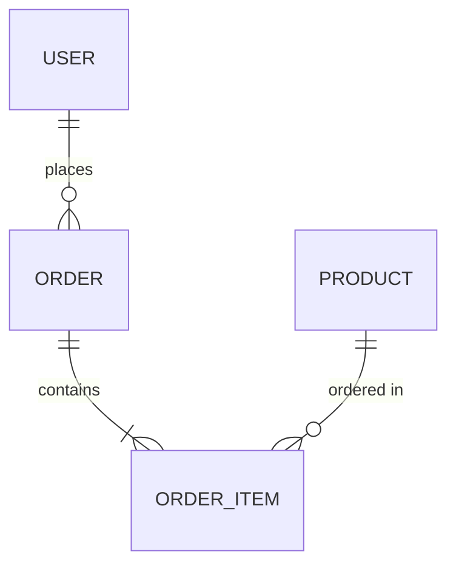
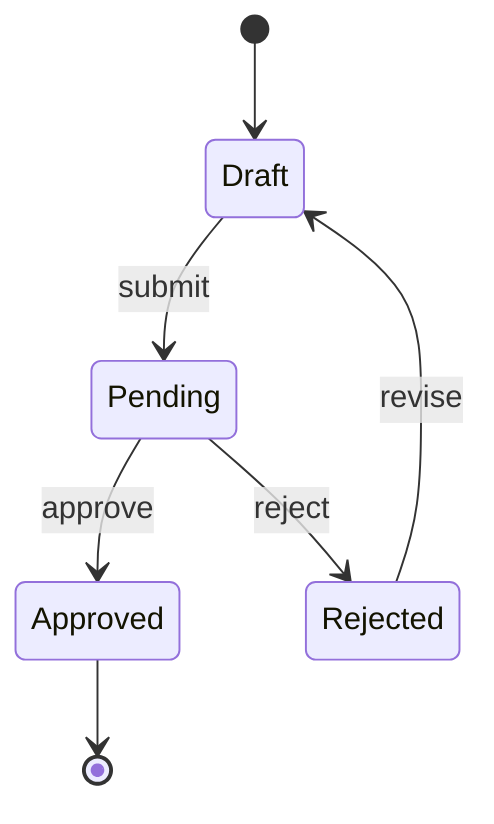

# PRD Creation Mission v3.1

**Mission Type**: Foundation Document Creation
**Estimated Duration**: 2-4 hours (Auto Mode) | 4-8 hours (Engaged Mode)
**Complexity**: High
**Prerequisites**: Business vision/idea defined, target market identified

---

## Mission Overview

Create a comprehensive Product Requirements Document (PRD) using the v3.1 template structure. This mission guides you through systematic requirements gathering, system architecture definition, and feature specification to produce a developer-ready PRD.

**PRD v3.1 introduces critical improvements**:
- **System Skeleton** (Section 2): Data model, UI structure, business rules BEFORE features
- **Traceable IDs**: F-001 feature IDs, T-001 test IDs with cross-references
- **GWT Format**: Given-When-Then acceptance criteria for all features
- **Handoff Readiness Checklist**: Validation before developer handoff
- **Preference Profile**: JSON export for AI agent context

---

## Reference Documents

### Required Templates
| Document | Location | Purpose |
|----------|----------|--------|
| PRD Template | `/docs/Document Library/Foundation/Product Requirements Document (PRD).md` | Master template structure (v3.1) |
| PRD Creation SOP | `/docs/Document Library/Foundation/PRD Creation SOP.md` | Step-by-step creation process (v2.1) |
| Solopreneur Defaults | `/docs/Document Library/Foundation/Solopreneur-Defaults.json` | Smart defaults for unanswered questions |

### Optional References
| Document | Location | Purpose |
|----------|----------|--------|
| Design Playbook Template | `/docs/Document Library/Foundation/Design Playbook Template.md` | UI/UX design system |
| Design Playbook Creation SOP | `/docs/Document Library/Foundation/Design Playbook Creation SOP.md` | Design document process |
| Vision and Mission | `/docs/Document Library/Foundation/Vision and Mission.md` | Business foundation |
| Market Research Template | `/docs/Document Library/Foundation/Market Research Template.md` | Market analysis |
| Client Success Blueprint | `/docs/Document Library/Foundation/Client Success Blueprint.md` | Customer personas |

---

## PRD v3.1 Structure Overview

The PRD v3.1 template consists of 8 major sections:

```
SECTION 0: AT-A-GLANCE
- Quick summary for stakeholders
- Elevator pitch and key metrics

SECTION 1: PRODUCT FOUNDATION
- Vision, problem statement, target users
- Value proposition and success metrics

SECTION 2: SYSTEM SKELETON (NEW - CRITICAL)
- Glossary of terms
- Conceptual Data Model (entities, relationships)
- UI Structure (sitemap with routes)
- Business Rules & State Machines
- External API Dependencies
- Data Privacy & Compliance

SECTION 3: FEATURES & REQUIREMENTS
- Features with F-IDs (F-001, F-002, etc.)
- GWT acceptance criteria
- Priority levels (P0, P1, P2)
- Entity relationships

SECTION 4: TESTING & VALIDATION
- Test cases with T-IDs (T-001, T-002)
- Linked to feature F-IDs
- GWT format test criteria

SECTION 5: ROADMAP & MILESTONES
- Phased delivery plan
- MVP scope definition

SECTION 6: METRICS & SUCCESS
- KPIs and measurement
- Launch criteria

SECTION 7: HANDOFF READINESS CHECKLIST
- Validation before developer handoff
- Quality gates

APPENDIX A: PREFERENCE PROFILE (JSON)
- Exported preferences for AI agents
- Business context snapshot
```

---

## PHASE 0: MODE SELECTION

**CRITICAL: This phase MUST be completed before proceeding. Mode cannot be changed mid-mission.**

### Execution Mode Selection

This mission supports two execution modes. Choose based on your needs:

#### AUTO MODE (Recommended for experienced users)
**Duration**: 2-4 hours
**Interaction**: Minimal - AI generates complete PRD with smart defaults
**Best for**:
- Users with clear product vision
- Rapid prototyping needs
- Experienced product managers
- When time is limited

**Process**:
1. Provide initial context (idea, market, constraints)
2. AI generates complete PRD using Solopreneur Defaults
3. Review generated document
4. Provide feedback for refinement
5. Validate Handoff Readiness Checklist

#### ENGAGED MODE (Recommended for first-time PRD creation)
**Duration**: 4-8 hours
**Interaction**: High - collaborative section-by-section creation
**Best for**:
- First product requirements document
- Complex products with many unknowns
- When stakeholder alignment is needed
- Learning the PRD creation process

**Process**:
1. Section-by-section guided creation
2. Expert perspectives provided for each section
3. Explicit approval gates between sections
4. Questions and refinement at each stage
5. Final validation with Handoff Readiness Checklist

---

### Mode Selection Prompt

**COORDINATOR MUST ASK**:

```
=== PRD CREATION MISSION v3.1 ===

Before we begin, please select your preferred creation mode:

[A] AUTO MODE (2-4 hours)
    - I'll generate a complete PRD based on your initial input
    - Uses smart defaults for unanswered questions
    - Minimal interaction, rapid output
    - Best if you have a clear vision

[E] ENGAGED MODE (4-8 hours)
    - Collaborative section-by-section creation
    - Expert perspectives at each stage
    - Deep exploration of requirements
    - Best for first-time PRD creation

Please respond with [A] or [E] to select your mode.

**Note**: Mode cannot be changed once the mission begins.
```

**CRITICAL**: Wait for explicit user response ([A] or [E]) before proceeding to Phase 1.

---

## PHASE 1: CONTEXT GATHERING

**Purpose**: Collect all available context before PRD generation to maximize quality and minimize questions.

### Step 1.1: Check for Existing PRD

**Search locations**:
```
/documents/foundation/prds/
/docs/requirements/
/PRD.md
/requirements/
```

**If existing PRD found**:
- Offer INCREMENTAL UPDATE MODE (see below)
- Present options: Update existing vs Create new
- Preserve user-edited content

**If no PRD found**:
- Proceed with new PRD creation
- Note this in context

### Step 1.2: Read Foundation Documents

**Check for and read these files if they exist**:

| Document | Typical Location | Context Extracted |
|----------|-----------------|-------------------|
| Vision & Mission | `/documents/foundation/vision-mission.md` | Business purpose, north star |
| Market Research | `/documents/foundation/market-research.md` | Target market, competitors |
| Client Blueprint | `/documents/foundation/client-success-blueprint.md` | User personas, pain points |
| Positioning Statement | `/documents/foundation/positioning-statement.md` | Value proposition, differentiation |
| Brand Style Guide | `/documents/foundation/brand-style-guide.md` | Design constraints |
| Ideation File | `/ideation.md` | Product concept, features |

**For each document found**:
1. Extract relevant context
2. Note key decisions already made
3. Identify gaps that need filling

### Step 1.3: Apply Solopreneur Defaults

**Load defaults from**: `/docs/Document Library/Foundation/Solopreneur-Defaults.json`

**Defaults provide smart answers for**:
- Team structure (solo founder assumed)
- Budget constraints (bootstrapped/lean)
- Tech stack preferences (modern, maintainable)
- Deployment preferences (cloud-first)
- Timeline expectations (rapid iteration)
- Legal/compliance baseline

**Usage rules**:
1. Apply defaults for any unanswered question
2. Mark applied defaults with `[DEFAULT]` tag
3. User can override any default during review
4. Track all defaults in Assumptions Log

### Step 1.4: Identify Blocking Questions

**Categorize open questions as**:

| Category | Definition | Action |
|----------|------------|--------|
| `[BLOCKING]` | Cannot proceed without answer | Must ask user |
| `[NON-BLOCKING]` | Can use default or defer | Apply default, note in log |

**Examples of BLOCKING questions**:
- Core product purpose (if not in any document)
- Primary user type (if multiple unclear options)
- Fundamental monetization model
- Critical legal/compliance requirements

**Examples of NON-BLOCKING questions**:
- Specific color preferences (use brand defaults)
- Exact timeline dates (use standard milestones)
- Third-party tool choices (recommend based on stack)
- Nice-to-have features (defer to P2)

---

## INCREMENTAL UPDATE MODE

**When to use**: An existing PRD is found and user wants to update rather than recreate.

### Available Update Commands

#### `--update-skeleton`
**Purpose**: Regenerate Section 2 (System Skeleton) only
**Use when**:
- Adding new entities to data model
- Restructuring UI architecture
- Adding new business rules

**Process**:
1. Read existing PRD
2. Preserve Sections 0, 1, 3-7 exactly
3. Regenerate Section 2 with new requirements
4. Update affected F-IDs in Section 3 (mark changes)
5. Present diff for approval

#### `--update-features`
**Purpose**: Regenerate Section 3 (Features) only
**Use when**:
- Reprioritizing features
- Adding multiple new features
- Restructuring feature organization

**Process**:
1. Read existing PRD
2. Preserve Sections 0, 1, 2, 4-7 exactly
3. Regenerate Section 3 with new features
4. Assign new F-IDs (continue numbering)
5. Update Section 4 with new test stubs
6. Present diff for approval

#### `--add-feature`
**Purpose**: Add a single new feature without full regeneration
**Use when**:
- Single feature addition
- Quick scope expansion
- User-requested enhancement

**Process**:
1. Read existing PRD
2. Determine next available F-ID
3. Generate feature block with GWT criteria
4. Identify touched entities (link to Section 2)
5. Generate corresponding T-IDs
6. Insert at appropriate location
7. Present addition for approval

### Golden Rule: Never Overwrite User Edits

**CRITICAL PRINCIPLE**: User-edited content is sacred.

**When updating existing PRD**:
1. Detect user modifications (compare to template)
2. Never overwrite user-customized content
3. Present proposed changes as DIFF format
4. Require explicit approval before applying
5. Offer "merge" option for conflicts

**Diff format**:
```diff
--- Section 3.2: User Management
+++ Section 3.2: User Management (Updated)

- **F-002**: Basic user authentication
+ **F-002**: Basic user authentication with MFA option
+   - Added: MFA toggle in user settings
+   - Added: Recovery code generation

[APPROVE] [REJECT] [MODIFY]
```

---

## AUTO MODE EXECUTION

**Prerequisites**:
- Mode selection complete (user chose [A])
- Phase 1 context gathering complete
- BLOCKING questions resolved

### Auto Mode Initial Prompt

After context gathering, request remaining information:

```
=== AUTO MODE: INITIAL CONTEXT ===

I've gathered the following context from your existing documents:
[List discovered context]

To generate your PRD, I need a few more details:

1. **PRODUCT DESCRIPTION** (1-3 sentences)
   What does your product do? Who is it for?

2. **CORE PROBLEM**
   What specific problem does this solve?

3. **KEY FEATURES** (list 3-7 main capabilities)
   What are the must-have features for launch?

4. **KNOWN CONSTRAINTS** (optional)
   - Budget limitations?
   - Technology requirements?
   - Timeline pressures?
   - Regulatory requirements?

5. **SUCCESS DEFINITION**
   How will you know the product is successful?

Please provide this information, and I'll generate your complete PRD.
```

### Auto Mode Generation Sequence

#### Step A1: Generate Section 0 (At-a-Glance)

**Content**:
- Product name and one-liner
- Elevator pitch (2-3 sentences)
- Target user summary
- Key metrics preview
- PRD version and date

**Template**:
```markdown
# Section 0: At-a-Glance

| Attribute | Value |
|-----------|-------|
| **Product Name** | [Name] |
| **Version** | 1.0 |
| **Last Updated** | [Date] |
| **Status** | Draft |
| **Owner** | [User] |

## Elevator Pitch
[2-3 sentence description]

## Target Users
[Primary user persona summary]

## Key Metrics
- Primary: [Main success metric]
- Secondary: [Supporting metrics]
```

#### Step A2: Generate Section 1 (Product Foundation)

**Content**:
- Vision statement
- Problem statement with evidence
- Target user personas (detailed)
- Value proposition
- Success metrics with targets

**Subsections**:
- 1.1 Vision & Mission
- 1.2 Problem Statement
- 1.3 Target Users
- 1.4 Value Proposition
- 1.5 Success Metrics

**Template**:
```markdown
# Section 1: Product Foundation

## 1.1 Vision & Mission

**Vision**: [Aspirational future state]

**Mission**: [How we'll achieve the vision]

## 1.2 Problem Statement

**The Problem**:
[Clear description of user pain point]

**Evidence**:
- [Market data or user research]
- [Competitor gaps]
- [User quotes or feedback]

**Impact of Not Solving**:
[Consequences for users]

## 1.3 Target Users

### Primary Persona: [Name]
- **Demographics**: [Age, role, context]
- **Goals**: [What they want to achieve]
- **Pain Points**: [Current frustrations]
- **Tech Savviness**: [Low/Medium/High]
- **Willingness to Pay**: [Price sensitivity]

### Secondary Persona: [Name]
[Similar structure]

## 1.4 Value Proposition

**For** [target user]
**Who** [has this problem]
**Our product** [product name]
**Is a** [category]
**That** [key benefit]
**Unlike** [alternatives]
**Our product** [key differentiator]

## 1.5 Success Metrics

| Metric | Target | Measurement Method |
|--------|--------|-------------------|
| [Primary KPI] | [Target value] | [How measured] |
| [Secondary KPI] | [Target value] | [How measured] |
```

#### Step A3: Generate Section 2 (System Skeleton) - CRITICAL

**This section is NEW in v3.1 and CRITICAL for developer handoff.**

**Purpose**: Define the structural foundation BEFORE features.

**Subsections**:

##### 2.1 Glossary
```markdown
## 2.1 Glossary

| Term | Definition | Context |
|------|------------|--------|
| [Term] | [Clear definition] | [How used in this product] |
| [Term] | [Clear definition] | [How used in this product] |
```

**Required terms**:
- All domain-specific vocabulary
- Technical terms used in features
- Business logic terminology
- User role definitions

##### 2.2 Conceptual Data Model
```markdown
## 2.2 Conceptual Data Model

### Entities

| Entity | Description | Key Attributes |
|--------|-------------|---------------|
| User | Person using the system | id, email, name, role, created_at |
| [Entity] | [Description] | [Attributes] |

### Relationships



### Relationship Descriptions

| Relationship | Type | Description |
|-------------|------|-------------|
| User -> Order | One-to-Many | A user can place multiple orders |
| [Relationship] | [Type] | [Description] |
```

**Requirements**:
- All entities referenced by features must be defined here
- Include cardinality (1:1, 1:N, M:N)
- Note cascade behaviors if applicable
- Include soft-delete strategy if applicable

##### 2.3 UI Structure (Sitemap)
```markdown
## 2.3 UI Structure

### Route Map

| Route | Page | Access | Description |
|-------|------|--------|-------------|
| `/` | Landing | Public | Marketing landing page |
| `/login` | Login | Public | User authentication |
| `/dashboard` | Dashboard | Auth | Main user dashboard |
| `/settings` | Settings | Auth | User preferences |
| [Route] | [Page] | [Access] | [Description] |

### Navigation Hierarchy

```
App
├── Public
│   ├── Landing (/)
│   ├── Login (/login)
│   └── Register (/register)
├── Authenticated
│   ├── Dashboard (/dashboard)
│   ├── [Feature Area] (/feature)
│   │   ├── List View (/feature/list)
│   │   └── Detail View (/feature/:id)
│   └── Settings (/settings)
└── Admin
    └── Admin Panel (/admin)
```

### Page Inventory

| Page | Components | Data Requirements |
|------|------------|------------------|
| Dashboard | StatsCard, RecentActivity, QuickActions | user, stats, activities |
| [Page] | [Components] | [Data] |
```

##### 2.4 Business Rules & State Machines
```markdown
## 2.4 Business Rules & State Machines

### Core Business Rules

| Rule ID | Rule | Enforcement |
|---------|------|-------------|
| BR-001 | [Business rule description] | [Frontend/Backend/Both] |
| BR-002 | [Business rule description] | [Frontend/Backend/Both] |

### State Machines

#### [Entity] States



| State | Description | Valid Transitions |
|-------|-------------|------------------|
| Draft | Initial state | -> Pending |
| Pending | Awaiting review | -> Approved, Rejected |
| Approved | Final approved state | None |
| Rejected | Needs revision | -> Draft |
```

##### 2.5 External API Dependencies
```markdown
## 2.5 External API Dependencies

| Service | Purpose | Required | Fallback |
|---------|---------|----------|----------|
| [Auth Provider] | User authentication | Yes | None |
| [Payment Gateway] | Payment processing | Yes | None |
| [Email Service] | Transactional emails | Yes | Queue for retry |
| [Analytics] | Usage tracking | No | Continue without |

### Integration Details

#### [Service Name]
- **Provider**: [Provider name]
- **API Version**: [Version]
- **Authentication**: [Method]
- **Rate Limits**: [Limits]
- **Estimated Costs**: [Cost structure]
```

##### 2.6 Data Privacy & Compliance
```markdown
## 2.6 Data Privacy & Compliance

### Data Classification

| Data Type | Classification | Storage | Retention |
|-----------|---------------|---------|----------|
| Email | PII | Encrypted | Account lifetime + 30 days |
| Password | Sensitive | Hashed (bcrypt) | Never stored plain |
| [Data] | [Classification] | [Storage] | [Retention] |

### Compliance Requirements

| Requirement | Applicability | Implementation |
|-------------|--------------|----------------|
| GDPR | EU Users | Data export, deletion on request |
| CCPA | CA Users | Opt-out mechanism |
| [Requirement] | [Scope] | [Implementation] |

### Consent Management
- [ ] Cookie consent banner required
- [ ] Marketing email opt-in required
- [ ] Terms acceptance required at signup
```

#### Step A4: Generate Section 3 (Features & Requirements)

**Feature ID Format**: F-001, F-002, F-003...

**Feature Types**:
- **Core**: Essential for MVP
- **Enhancement**: Improves core functionality
- **Integration**: Connects external services

**Priority Levels**:
- **P0**: Must have for launch (MVP)
- **P1**: Should have, high value
- **P2**: Nice to have, future consideration

**Template for each feature**:
```markdown
### F-001: [Feature Name]

**Type**: Core | Enhancement | Integration
**Priority**: P0 | P1 | P2
**Touched Entities**: User, Order, [entities from Section 2]
**Estimated Effort**: [S/M/L/XL]

#### Description
[Clear description of the feature]

#### User Story
As a [user type], I want to [action] so that [benefit].

#### Acceptance Criteria (GWT Format)

**AC-001**:
- **Given** [precondition]
- **When** [action]
- **Then** [expected result]

**AC-002**:
- **Given** [precondition]
- **When** [action]
- **Then** [expected result]

#### UI/UX Notes
- [Design considerations]
- [Interaction details]

#### Technical Notes
- [Implementation guidance]
- [Constraints or considerations]

#### Dependencies
- Depends on: [F-XXX, F-YYY]
- Blocks: [F-ZZZ]
```

**Feature Organization**:
```markdown
# Section 3: Features & Requirements

## 3.1 Authentication & Authorization
- F-001: User Registration
- F-002: User Login
- F-003: Password Reset
- F-004: Role-Based Access Control

## 3.2 [Feature Area]
- F-005: [Feature]
- F-006: [Feature]

## 3.3 [Feature Area]
- F-007: [Feature]
- F-008: [Feature]
```

#### Step A5: Generate Section 4 (Testing & Validation)

**Test ID Format**: T-001, T-002, T-003...

**Each test must link to Feature ID(s)**.

**Template**:
```markdown
# Section 4: Testing & Validation

## 4.1 Test Strategy

### Testing Levels
| Level | Coverage | Tools |
|-------|----------|-------|
| Unit | Core business logic | Jest/Vitest |
| Integration | API endpoints | Supertest |
| E2E | Critical user flows | Playwright |

### Test Environments
| Environment | Purpose | Data |
|-------------|---------|------|
| Development | Feature testing | Mock data |
| Staging | Integration testing | Sanitized prod data |
| Production | Smoke tests only | Real data |

## 4.2 Test Cases

### T-001: [Test Name]
**Features Tested**: F-001, F-002
**Type**: Unit | Integration | E2E
**Priority**: Critical | High | Medium | Low

**Test Steps (GWT)**:
- **Given** [precondition/setup]
- **When** [action performed]
- **Then** [expected outcome]

**Test Data**:
- [Required test data]

**Pass Criteria**:
- [Specific criteria for pass]

---

### T-002: [Test Name]
[Same structure]
```

**Coverage Matrix**:
```markdown
## 4.3 Coverage Matrix

| Feature | Unit | Integration | E2E |
|---------|------|-------------|-----|
| F-001 | T-001 | T-010 | T-020 |
| F-002 | T-002 | T-011 | T-020 |
| F-003 | T-003 | T-012 | T-021 |
```

#### Step A6: Generate Sections 5-6 (Roadmap & Metrics)

**Section 5: Roadmap & Milestones**
```markdown
# Section 5: Roadmap & Milestones

## 5.1 Phase Overview

| Phase | Focus | Duration | Key Deliverables |
|-------|-------|----------|------------------|
| Phase 1 (MVP) | Core functionality | [X weeks] | F-001, F-002, F-003 |
| Phase 2 | Enhanced features | [X weeks] | F-004, F-005 |
| Phase 3 | Scale & optimize | [X weeks] | F-006, F-007 |

## 5.2 MVP Scope

### Included (P0 Features)
- [ ] F-001: [Feature]
- [ ] F-002: [Feature]
- [ ] F-003: [Feature]

### Explicitly Excluded (Deferred)
- F-004: [Feature] - Deferred to Phase 2
- F-005: [Feature] - Deferred to Phase 2

## 5.3 Milestone Schedule

| Milestone | Target Date | Success Criteria |
|-----------|-------------|------------------|
| Design Complete | [Date] | All wireframes approved |
| MVP Dev Complete | [Date] | All P0 features implemented |
| QA Complete | [Date] | All T-XXX tests passing |
| Launch | [Date] | Production deployment |

## 5.4 Risk Assessment

| Risk | Probability | Impact | Mitigation |
|------|-------------|--------|------------|
| [Risk] | High/Med/Low | High/Med/Low | [Mitigation strategy] |
```

**Section 6: Metrics & Success**
```markdown
# Section 6: Metrics & Success

## 6.1 Key Performance Indicators

### Primary KPIs
| KPI | Definition | Target | Measurement |
|-----|------------|--------|-------------|
| [KPI Name] | [What it measures] | [Target value] | [How measured] |

### Secondary KPIs
| KPI | Definition | Target | Measurement |
|-----|------------|--------|-------------|
| [KPI Name] | [What it measures] | [Target value] | [How measured] |

## 6.2 Launch Criteria

### Must Have (Go/No-Go)
- [ ] All P0 features complete and tested
- [ ] All Critical/High priority tests passing
- [ ] Performance benchmarks met
- [ ] Security review complete
- [ ] Legal review complete (if applicable)

### Should Have
- [ ] Documentation complete
- [ ] Support team trained
- [ ] Analytics tracking verified

## 6.3 Success Milestones

| Timeframe | Metric | Target |
|-----------|--------|--------|
| Launch Day | System uptime | 99% |
| Week 1 | Active users | [Target] |
| Month 1 | Retention rate | [Target] |
| Month 3 | Revenue/Conversion | [Target] |
```

#### Step A7: Generate Section 7 (Handoff Readiness Checklist)

```markdown
# Section 7: Handoff Readiness Checklist

This checklist must be completed before developer handoff.

## 7.1 Document Completeness

### Section Validation
- [ ] Section 0 (At-a-Glance): Complete
- [ ] Section 1 (Product Foundation): Complete
- [ ] Section 2 (System Skeleton): Complete
  - [ ] 2.1 Glossary: All terms defined
  - [ ] 2.2 Data Model: All entities with relationships
  - [ ] 2.3 UI Structure: All routes mapped
  - [ ] 2.4 Business Rules: All rules documented
  - [ ] 2.5 API Dependencies: All integrations listed
  - [ ] 2.6 Privacy & Compliance: Requirements documented
- [ ] Section 3 (Features): Complete
  - [ ] All features have F-IDs
  - [ ] All P0 features have GWT acceptance criteria
  - [ ] All features linked to touched entities
- [ ] Section 4 (Testing): Complete
  - [ ] All tests have T-IDs
  - [ ] All tests linked to F-IDs
- [ ] Section 5 (Roadmap): Complete
- [ ] Section 6 (Metrics): Complete

## 7.2 Quality Gates

### Traceability
- [ ] Every feature has a unique F-ID
- [ ] Every test has a unique T-ID
- [ ] Every test links to at least one feature
- [ ] Every feature links to entities in data model

### Clarity
- [ ] No ambiguous requirements ("should", "might", "could")
- [ ] All acceptance criteria are testable
- [ ] All business rules are explicit
- [ ] All edge cases documented

### Completeness
- [ ] All BLOCKING questions answered
- [ ] All assumptions documented in Assumptions Log
- [ ] All dependencies identified
- [ ] All risks assessed with mitigations

## 7.3 Open Items

### BLOCKING Items (Must resolve before handoff)
| Item | Description | Owner | Due Date |
|------|-------------|-------|----------|
| [Item] | [Description] | [Owner] | [Date] |

### NON-BLOCKING Items (Can resolve during development)
| Item | Description | Owner | Due Date |
|------|-------------|-------|----------|
| [Item] | [Description] | [Owner] | [Date] |

## 7.4 Handoff Approval

| Role | Name | Date | Signature |
|------|------|------|-----------|
| Product Owner | [Name] | [Date] | [ ] Approved |
| Tech Lead | [Name] | [Date] | [ ] Approved |
| Designer | [Name] | [Date] | [ ] Approved |
```

#### Step A8: Generate Appendix A (Preference Profile JSON)

```markdown
# Appendix A: Preference Profile

This JSON export captures key product decisions for AI agent context.

```json
{
  "product": {
    "name": "[Product Name]",
    "type": "[SaaS/Mobile App/Web App/API/etc.]",
    "stage": "[Concept/MVP/Growth/Scale]"
  },
  "business": {
    "model": "[Subscription/Freemium/One-time/Usage-based]",
    "target_market": "[B2B/B2C/B2B2C]",
    "industry": "[Industry vertical]"
  },
  "technical": {
    "preferred_stack": {
      "frontend": "[Framework]",
      "backend": "[Framework/Language]",
      "database": "[Database type]",
      "hosting": "[Platform]"
    },
    "constraints": [
      "[Technical constraint 1]",
      "[Technical constraint 2]"
    ]
  },
  "priorities": {
    "speed_vs_quality": "[speed/balanced/quality]",
    "build_vs_buy": "[build/balanced/buy]",
    "mvp_focus": true
  },
  "personas": {
    "primary": {
      "name": "[Persona name]",
      "role": "[Role]",
      "tech_level": "[Low/Medium/High]"
    }
  }
}
```
```

### Auto Mode Assumptions Log

**Throughout generation, log all assumptions**:

```markdown
# Assumptions Log

## Applied Defaults
| Assumption | Default Used | Source | Override? |
|------------|-------------|--------|-----------|
| Team size | Solo founder | Solopreneur-Defaults.json | [User can override] |
| Budget | Bootstrapped/Lean | Solopreneur-Defaults.json | [User can override] |
| [Assumption] | [Default] | [Source] | [Override status] |

## Inferred Decisions
| Decision | Inference | Confidence | Rationale |
|----------|-----------|------------|----------|
| [Decision] | [What was inferred] | [High/Med/Low] | [Why] |

## Flagged for Review
| Item | Category | Notes |
|------|----------|-------|
| [Item] | [BLOCKING/NON-BLOCKING] | [Context] |
```

### Auto Mode Final Output

After generating all sections:

1. **Compile complete PRD** in single document
2. **Run Handoff Readiness Checklist** (Section 7)
3. **Present summary** with:
   - Total features generated (with F-ID count)
   - Total tests generated (with T-ID count)
   - Entity count and relationship count
   - Assumptions made (count and summary)
   - BLOCKING items requiring attention
   - NON-BLOCKING items for future review

4. **Request review**:
```
=== PRD GENERATION COMPLETE ===

I've generated your PRD v3.1 with:
- [X] features (F-001 to F-XXX)
- [X] test cases (T-001 to T-XXX)
- [X] entities in data model
- [X] assumptions applied (see Assumptions Log)

Handoff Readiness Status:
- [X/X] checklist items complete
- [X] BLOCKING items to resolve
- [X] NON-BLOCKING items noted

Please review the document and let me know:
1. Any sections that need revision
2. Any assumptions to override
3. Any BLOCKING items to address
4. Approval to save final version
```

---

## ENGAGED MODE EXECUTION

**Prerequisites**:
- Mode selection complete (user chose [E])
- Phase 1 context gathering complete
- BLOCKING questions identified

### Engaged Mode Philosophy

**Principles**:
1. **Section-by-section creation** with explicit approval gates
2. **Expert perspectives** provided for each section
3. **Clarifying questions** before generation
4. **Iterative refinement** within each section
5. **User maintains control** throughout process

### Section-by-Section Process

#### Engaged Step 1: Section 0 (At-a-Glance)

**Perspectives to consider**:
- Executive sponsor perspective: "What's the 30-second pitch?"
- Investor perspective: "What's the market opportunity?"
- Developer perspective: "What am I building?"

**Questions to ask**:
```
=== SECTION 0: AT-A-GLANCE ===

Before I create the summary section, let me confirm:

1. What's your product's working name?
2. Can you give me a 1-2 sentence description?
3. Who is the primary decision-maker for this PRD?
4. What's the current status? (Concept/Active Development/Live)

[I'll use your answers to create the At-a-Glance section]
```

**After generation**:
```
I've created Section 0. Please review:

[Section content]

- Does this accurately represent your product?
- Any changes needed to the elevator pitch?
- Ready to proceed to Section 1? [APPROVE/REVISE]
```

---

#### Engaged Step 2: Section 1 (Product Foundation)

**Perspectives to consider**:
- User perspective: "What problem does this solve for me?"
- Business perspective: "How does this create value?"
- Market perspective: "Why now? Why this approach?"

**Subsection 1.1 - Vision & Mission**:
```
=== SECTION 1.1: VISION & MISSION ===

Let's establish your product's north star.

1. **Vision**: Where do you want this product to be in 3-5 years?
   (Aspirational future state)

2. **Mission**: How will you get there?
   (Concrete approach to achieving vision)

[Examples provided for reference]
```

**Subsection 1.2 - Problem Statement**:
```
=== SECTION 1.2: PROBLEM STATEMENT ===

1. **Core Problem**: What specific pain point are you solving?

2. **Evidence**: How do you know this is a real problem?
   - User research/interviews?
   - Personal experience?
   - Market data?

3. **Impact**: What happens if users don't solve this problem?
```

**Subsection 1.3 - Target Users**:
```
=== SECTION 1.3: TARGET USERS ===

Let's define your primary user persona.

1. **Who is your ideal user?**
   - Demographics (age, role, industry)
   - Goals (what are they trying to achieve)
   - Pain points (current frustrations)

2. **Is there a secondary persona?**
   (Another user type who uses the product differently)

3. **Who is NOT your target user?**
   (Explicitly excluding helps focus)
```

**Subsection 1.4 - Value Proposition**:
```
=== SECTION 1.4: VALUE PROPOSITION ===

Let's craft your value proposition:

For [target user]
Who [has this problem]
Our product [product name]
Is a [category]
That [key benefit]
Unlike [alternatives]
Our product [key differentiator]

Please fill in each blank.
```

**Subsection 1.5 - Success Metrics**:
```
=== SECTION 1.5: SUCCESS METRICS ===

How will you measure success?

1. **Primary Metric**: The ONE metric that defines success
   (e.g., Monthly Active Users, Revenue, NPS)

2. **Supporting Metrics**: 2-3 additional metrics
   (e.g., Retention rate, Conversion rate, Time to value)

3. **Anti-Metrics**: What you're NOT optimizing for
   (Helps prevent wrong trade-offs)
```

**Section 1 Approval Gate**:
```
=== SECTION 1 COMPLETE ===

I've compiled your Product Foundation section:

[Full Section 1 content]

**Checklist**:
- [ ] Vision and mission resonate
- [ ] Problem statement is clear and evidenced
- [ ] Target users are well-defined
- [ ] Value proposition differentiates
- [ ] Success metrics are measurable

Ready to proceed to Section 2 (System Skeleton)?
[APPROVE] [REVISE SECTION]
```

---

#### Engaged Step 3: Section 2 (System Skeleton) - CRITICAL

**IMPORTANT**: This is the most critical section for developer handoff.

**Perspectives to consider**:
- Architect perspective: "What are the core building blocks?"
- Developer perspective: "What data do I need to model?"
- UX designer perspective: "What's the information architecture?"

**Subsection 2.1 - Glossary**:
```
=== SECTION 2.1: GLOSSARY ===

Let's define the language of your product.

Based on our discussion, I've identified these terms that need definition:
[List of terms extracted from previous sections]

1. For each term, provide:
   - Clear definition
   - How it's used in your product

2. Are there any other domain-specific terms?

3. Any terms that might be confused with common meanings?
```

**Subsection 2.2 - Conceptual Data Model**:
```
=== SECTION 2.2: CONCEPTUAL DATA MODEL ===

Let's define what "things" exist in your system.

**Core Entities** (based on your features):
[List of potential entities identified]

For each entity:
1. What is it? (description)
2. What information does it have? (key attributes)
3. How does it relate to other entities?

**Relationships**:
- Does a User have many [X]?
- Does [X] belong to one [Y]?
- Can [X] be shared between multiple [Y]s?

[I'll generate an entity-relationship diagram based on your answers]
```

**Subsection 2.3 - UI Structure**:
```
=== SECTION 2.3: UI STRUCTURE ===

Let's map out your application's pages and navigation.

1. **Public pages** (no login required):
   - Landing page? Marketing pages?
   - Login/Register?

2. **Authenticated pages** (login required):
   - What's the main dashboard?
   - What feature areas do users navigate to?
   - Settings/Profile pages?

3. **Admin pages** (if applicable):
   - Admin dashboard?
   - User management?

4. **Navigation pattern**:
   - Sidebar? Top nav? Tab bar?
```

**Subsection 2.4 - Business Rules & State Machines**:
```
=== SECTION 2.4: BUSINESS RULES & STATE MACHINES ===

**Business Rules**:
What rules govern how your system behaves?

Examples:
- "Users can only have one active subscription"
- "Orders cannot be cancelled after shipping"
- "Free tier limited to 100 items"

List your key business rules.

**State Machines**:
Do any entities go through defined states?

Examples:
- Order: Draft -> Pending -> Paid -> Shipped -> Delivered
- User: Invited -> Active -> Suspended
- Subscription: Trial -> Active -> Cancelled

Describe any state flows.
```

**Subsection 2.5 - External API Dependencies**:
```
=== SECTION 2.5: EXTERNAL API DEPENDENCIES ===

What external services will your product use?

**Authentication**:
- Build custom? Or use [Auth0/Clerk/Supabase Auth/etc.]?

**Payments** (if applicable):
- Stripe? PayPal? Other?

**Email**:
- SendGrid? Postmark? Resend? Other?

**Other Services**:
- Analytics? (Mixpanel, Amplitude, PostHog)
- File storage? (S3, Cloudinary)
- Search? (Algolia, Typesense)
- AI/ML? (OpenAI, etc.)

For each service:
- Required or optional?
- Fallback if unavailable?
```

**Subsection 2.6 - Data Privacy & Compliance**:
```
=== SECTION 2.6: DATA PRIVACY & COMPLIANCE ===

**User Data**:
1. What personal data will you collect?
   (Email, name, payment info, usage data, etc.)

2. How will sensitive data be protected?
   (Encryption, hashing, access controls)

**Compliance Requirements**:
1. Will you have EU users? (GDPR applies)
2. Will you have CA users? (CCPA applies)
3. Healthcare data? (HIPAA may apply)
4. Financial data? (PCI-DSS may apply)

**Consent**:
1. Cookie consent needed?
2. Marketing email opt-in?
3. Terms of Service acceptance?
```

**Section 2 Approval Gate**:
```
=== SECTION 2 COMPLETE ===

I've compiled your System Skeleton:

[Full Section 2 content with diagrams]

**Checklist**:
- [ ] All terms defined in glossary
- [ ] All entities identified with attributes
- [ ] All relationships mapped
- [ ] All pages and routes defined
- [ ] All business rules documented
- [ ] All state machines diagrammed
- [ ] All external services listed
- [ ] Privacy and compliance addressed

This is the foundation for features. Ready to proceed?
[APPROVE] [REVISE SECTION]
```

---

#### Engaged Step 4: Section 3 (Features & Requirements)

**Perspectives to consider**:
- User perspective: "What can I do with this product?"
- Developer perspective: "What exactly do I need to build?"
- QA perspective: "How will I test this?"

**Feature Identification**:
```
=== SECTION 3: FEATURES & REQUIREMENTS ===

Now we'll define the specific features.

Based on your Product Foundation and System Skeleton,
I've identified these potential feature areas:

1. [Feature Area 1] - [Brief description]
2. [Feature Area 2] - [Brief description]
3. [Feature Area 3] - [Brief description]

**For each area, we'll define**:
- Specific features with F-IDs
- User stories
- Acceptance criteria (GWT format)
- Priority (P0/P1/P2)

Let's start with [Feature Area 1].

What specific capabilities do users need here?
```

**For each feature**:
```
=== FEATURE: [F-XXX] [Feature Name] ===

**Type**: [Core/Enhancement/Integration]
**Priority**: What priority level?
  - P0: Must have for MVP
  - P1: Should have, high value
  - P2: Nice to have, can defer

**User Story**:
As a [user type], I want to [action] so that [benefit].

**Acceptance Criteria**:
What must be true for this feature to be complete?

I'll structure these as Given-When-Then:
- Given [context]
- When [action]
- Then [result]

How many AC do you need for this feature?

**Entities Touched**:
Looking at your data model, this feature touches:
[List of entities]

Any others?
```

**Section 3 Approval Gate**:
```
=== SECTION 3 COMPLETE ===

I've compiled your Features & Requirements:

**Summary**:
- Total Features: [X]
- P0 (MVP): [X] features
- P1: [X] features
- P2: [X] features

[Full Section 3 content]

**Checklist**:
- [ ] All features have unique F-IDs
- [ ] All P0 features have GWT acceptance criteria
- [ ] All features link to touched entities
- [ ] Priority is clear and justified
- [ ] Dependencies between features noted

Ready to proceed to Testing?
[APPROVE] [REVISE SECTION]
```

---

#### Engaged Step 5: Section 4 (Testing & Validation)

**Perspectives to consider**:
- QA perspective: "How do I verify this works?"
- User perspective: "What does success look like?"
- Developer perspective: "What edge cases exist?"

**Test Generation**:
```
=== SECTION 4: TESTING & VALIDATION ===

Now we'll create test cases for your features.

For each feature, I'll generate:
- Test case(s) with T-IDs
- GWT format steps
- Link to feature F-IDs

**Test Strategy Questions**:
1. What level of testing is most important?
   - Unit tests (code level)
   - Integration tests (API level)
   - E2E tests (user flow level)

2. Are there specific browsers/devices to test?

3. What testing tools/frameworks are preferred?
```

**Section 4 Approval Gate**:
```
=== SECTION 4 COMPLETE ===

**Summary**:
- Total Test Cases: [X]
- Linked Features: [X/X] features covered

[Full Section 4 content with coverage matrix]

**Checklist**:
- [ ] All tests have unique T-IDs
- [ ] All tests link to F-IDs
- [ ] All P0 features have test coverage
- [ ] Test strategy defined
- [ ] Coverage matrix complete

Ready to proceed to Roadmap?
[APPROVE] [REVISE SECTION]
```

---

#### Engaged Step 6: Sections 5-6 (Roadmap & Metrics)

```
=== SECTION 5: ROADMAP & MILESTONES ===

Let's plan the delivery.

**MVP Scope**:
Based on P0 features, your MVP includes:
[List of P0 features]

Confirm: Is this the right MVP scope?

**Timeline**:
1. What's your target launch date?
2. Are there external deadlines? (funding, event, etc.)
3. Preferred phase duration? (2-week sprints? Monthly releases?)

**Risks**:
What could prevent successful delivery?
1. Technical risks?
2. Resource risks?
3. External dependencies?
```

```
=== SECTION 6: METRICS & SUCCESS ===

Let's define success measurement.

**Launch Criteria**:
What MUST be true to launch?
- Technical requirements?
- Quality requirements?
- Business requirements?

**Post-Launch Metrics**:
How will you know if it's successful?
- Day 1 metrics?
- Week 1 metrics?
- Month 1 metrics?
```

---

#### Engaged Step 7: Section 7 (Handoff Readiness)

```
=== SECTION 7: HANDOFF READINESS ===

Final validation before handoff.

I'll run through the checklist:

[Run complete Handoff Readiness Checklist]

**Status**:
- Complete: [X/X] items
- BLOCKING: [X] items require attention
- NON-BLOCKING: [X] items noted for later

**BLOCKING Items**:
[List any blockers]

Would you like to resolve these now?
```

---

#### Engaged Step 8: Appendix A (Preference Profile)

```
=== APPENDIX A: PREFERENCE PROFILE ===

I'll generate a JSON export of your key preferences.

This can be used by AI agents in future sessions.

[Generate JSON based on all gathered information]

Does this accurately capture your preferences?
```

---

### Engaged Mode Final Compilation

```
=== PRD CREATION COMPLETE ===

Your PRD v3.1 is complete!

**Document Summary**:
- Sections: 0-7 + Appendix A
- Features: [X] total (F-001 to F-XXX)
- Test Cases: [X] total (T-001 to T-XXX)
- Entities: [X] in data model
- Pages: [X] in UI structure

**Handoff Readiness**: [X/X] checklist items complete
- BLOCKING: [X] (must resolve before handoff)
- NON-BLOCKING: [X] (can resolve during development)

**Next Steps**:
1. [Resolve any BLOCKING items]
2. Save PRD to /documents/foundation/prds/
3. Create Design Playbook (optional)
4. Hand off to AGENT-11 for implementation

Would you like me to save the final document?
[SAVE] [REVISE] [EXPORT JSON]
```

---

## POST-CREATION VALIDATION

**After PRD generation (either mode), run this validation**:

### Validation Checklist

```
=== POST-CREATION VALIDATION ===

Running final validation...

**1. Structure Validation**
- [ ] Section 0: At-a-Glance present
- [ ] Section 1: Product Foundation complete
- [ ] Section 2: System Skeleton complete
  - [ ] Glossary has 5+ terms
  - [ ] Data model has entities
  - [ ] All entities have relationships defined
  - [ ] UI structure has routes
  - [ ] Business rules documented
  - [ ] External APIs listed
  - [ ] Privacy section complete
- [ ] Section 3: Features complete
  - [ ] All features have F-IDs
  - [ ] F-ID format: F-XXX (three digits)
  - [ ] All P0 features have 2+ GWT criteria
  - [ ] All features link to entities
- [ ] Section 4: Testing complete
  - [ ] All tests have T-IDs
  - [ ] T-ID format: T-XXX (three digits)
  - [ ] All tests link to F-IDs
- [ ] Section 5: Roadmap complete
- [ ] Section 6: Metrics complete
- [ ] Section 7: Handoff Checklist present
- [ ] Appendix A: Preference Profile (JSON) present

**2. Traceability Validation**
- [ ] Every F-ID is unique
- [ ] Every T-ID is unique
- [ ] Every test references valid F-IDs
- [ ] Every feature references valid entities
- [ ] Coverage matrix matches features/tests

**3. Quality Validation**
- [ ] No [BLOCKING] items remain
- [ ] All assumptions documented
- [ ] No ambiguous language ("should", "might", "could")
- [ ] All acceptance criteria are testable
- [ ] MVP scope clearly defined

**4. Completeness Validation**
- [ ] Vision statement present
- [ ] Problem statement has evidence
- [ ] At least 1 user persona defined
- [ ] Value proposition complete
- [ ] Success metrics have targets
- [ ] Launch criteria defined
- [ ] Risks identified with mitigations

**Validation Result**: [PASS/FAIL with details]
```

### Fix Recommendations

If validation fails, provide specific remediation:

```
=== VALIDATION ISSUES FOUND ===

**Issues to fix**:

1. [Issue]: [Description]
   **Fix**: [Specific action to resolve]
   **Location**: [Section.subsection]

2. [Issue]: [Description]
   **Fix**: [Specific action to resolve]
   **Location**: [Section.subsection]

Would you like me to fix these issues automatically?
[AUTO-FIX] [MANUAL REVIEW]
```

---

## SUCCESS CRITERIA

PRD Creation mission is successful when:

### Document Quality
- [ ] All 8 sections (0-7 + Appendix) complete
- [ ] System Skeleton (Section 2) fully populated
- [ ] All entities defined with relationships
- [ ] All features have F-IDs (format: F-XXX)
- [ ] All tests have T-IDs (format: T-XXX)
- [ ] All P0 features have GWT acceptance criteria
- [ ] Coverage matrix shows feature-test links

### Validation Passed
- [ ] Handoff Readiness Checklist: 100% complete
- [ ] Zero [BLOCKING] open questions
- [ ] All assumptions documented
- [ ] Post-creation validation: PASS

### Artifacts Created
- [ ] PRD document saved to `/documents/foundation/prds/[name]-prd.md`
- [ ] Preference Profile JSON in Appendix A
- [ ] Assumptions Log documented

### Ready for Handoff
- [ ] PRD can be handed to AGENT-11 for implementation
- [ ] Developer can start with clear requirements
- [ ] No additional clarification needed for MVP features

---

## OUTPUT LOCATION

Save completed PRD to:
```
/documents/foundation/prds/[product-name]-prd.md
```

Example:
```
/documents/foundation/prds/task-tracker-prd.md
/documents/foundation/prds/invoice-app-prd.md
/documents/foundation/prds/crm-system-prd.md
```

---

## RELATED MISSIONS

### Prerequisite Missions (Optional but Recommended)
- **Vision & Mission Creation**: `/missions/foundation/vision-mission.md`
- **Market Research**: `/missions/foundation/market-research.md`
- **Client Success Blueprint**: `/missions/foundation/client-blueprint.md`

### Follow-up Missions
- **Design Playbook Creation**: `/missions/foundation/design-playbook.md`
- **Technical Architecture**: Hand off to AGENT-11 for `/coord dev-setup`
- **Marketing Bible Creation**: `/missions/marketing/marketing-bible-creation.md`

---

## QUICK REFERENCE

### Commands

| Command | Purpose |
|---------|--------|
| `/coord prd-creation` | Start new PRD creation |
| `/coord prd-creation --update-skeleton` | Regenerate Section 2 only |
| `/coord prd-creation --update-features` | Regenerate Section 3 only |
| `/coord prd-creation --add-feature` | Add single new feature |

### Key Formats

| Element | Format | Example |
|---------|--------|--------|
| Feature ID | F-XXX | F-001, F-012, F-103 |
| Test ID | T-XXX | T-001, T-012, T-103 |
| Business Rule ID | BR-XXX | BR-001, BR-002 |
| Acceptance Criteria | GWT | Given/When/Then |

### Priority Levels

| Priority | Meaning | MVP? |
|----------|---------|------|
| P0 | Must have | Yes |
| P1 | Should have | No |
| P2 | Nice to have | No |

### Feature Types

| Type | Description |
|------|------------|
| Core | Essential product functionality |
| Enhancement | Improves existing functionality |
| Integration | Connects external services |

---

## CHANGELOG

### v3.1 (Current)
- Added System Skeleton section (Section 2)
- Added F-ID and T-ID traceability
- Added GWT acceptance criteria format
- Added Handoff Readiness Checklist
- Added Preference Profile JSON export
- Added Incremental Update Mode
- Enhanced context gathering phase
- Added Solopreneur Defaults integration
- Added post-creation validation

### v2.0
- Initial structured PRD template
- Auto and Engaged modes
- Basic feature and testing sections

---

*Mission file version: 3.1*
*Last updated: 2026-01-10*
*Compatible with: PRD Template v3.1, PRD Creation SOP v2.1*
