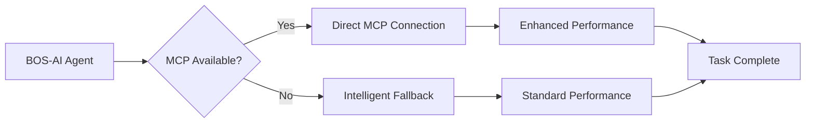

# BOS-AI: Business Operating System with AI Agent Suite
## Transforming Solopreneur Excellence Through Systematic AI-Augmented Operations


> **📚 Need Help?** Check [Troubleshooting](#-troubleshooting--faq) | [Requirements](#-system-requirements) | [Documentation](CLAUDE.md)

---

## 🚀 Quick Start - One-Line Installation

### Step 1: Open Terminal in Your Project
```bash
# Navigate to your business project directory
cd ~/your-business-project
```

### Step 2: Install BOS-AI with MCP Support (Choose Your Tier)

#### 🚀 NEW: Enhanced Installation with MCP Integration
```bash
# Install with automatic MCP configuration (Recommended)
curl -fsSL https://raw.githubusercontent.com/TheWayWithin/BOS-AI/main/deployment/scripts/install-with-mcp.sh | bash -s full
```
**Includes:** All 30 agents + automatic MCP detection + intelligent fallbacks

#### Option A: Starter Tier (5 Essential Agents)
```bash
curl -fsSL https://raw.githubusercontent.com/TheWayWithin/BOS-AI/main/deployment/scripts/install.sh | bash -s starter
```
**Perfect for:** Getting started, small businesses, testing the system

#### Option B: Business Tier (15 Core Agents)
```bash
curl -fsSL https://raw.githubusercontent.com/TheWayWithin/BOS-AI/main/deployment/scripts/install.sh | bash -s business
```
**Perfect for:** Growing businesses, comprehensive operations

#### Option C: Full Suite (All 30 Agents)
```bash
curl -fsSL https://raw.githubusercontent.com/TheWayWithin/BOS-AI/main/deployment/scripts/install.sh | bash -s full
```
**Perfect for:** Established businesses, complete automation

### Step 3: Start Using BOS-AI in Claude Code
```bash
# Open Claude Code in your project
claude code .

# Test your installation
/coord optimize    # Run Business Chassis optimization
```

### 📊 Installation Tiers Comparison

| Tier | Agents | Use Case | Key Features |
|------|--------|----------|-------------|
| **Starter** | 5 | New businesses | Core coordination, revenue optimization, pipeline management |
| **Business** | 15 | Growing companies | + Market intelligence, quality assurance, marketing suite |
| **Full** | 30 | Established firms | Complete suite with legal, financial, all specialized agents |

---

## 🔄 The BOS-AI Workflow: From Vision to Market Leadership

BOS-AI guides you through four interconnected stages of business development, creating a continuous cycle of improvement and growth:

### Stage 1: Foundation Documents (BOS-AI) ⚡
**Time:** 6-8 hours | **Output:** Vision, Mission, ICP, Positioning, Roadmap, PRD

Build your strategic foundation before building anything else:

**Core Strategic Documents:**
- **Vision and Mission** (1 hour) - Your North Star and strategic purpose
- **Market Research** (1 hour) - Deep understanding of your market landscape
- **Client Success Blueprint** (1 hour) - Ideal Customer Profile and intelligence
- **Positioning Statement** (1 hour) - Competitive differentiation framework
- **Strategic Roadmap** (1 hour) - Product development pathway and priorities
- **Brand Style Guide** (1 hour) - Visual identity and brand consistency
- **Product Requirements Document** (PRD) - What to build and why

**Why Foundation First?**
- 60-80% higher long-term success rates
- $55K-200K risk mitigation through strategic clarity
- 3x faster growth through aligned execution
- Premium positioning enabling higher margins

**Commands:**
```bash
# Complete foundation framework (6-8 hours)
/coord foundation-system-setup

# Rapid strategic foundation (3-4 hours essential foundation)
/coord foundation-quick-start

# Individual foundation documents (1 hour each)
/coord foundation-vision-mission-creation
/coord foundation-market-research-creation
/coord foundation-client-blueprint-creation
/coord foundation-positioning-creation
/coord foundation-roadmap-creation
/coord foundation-brand-guide-creation
```

**Output:** Strategic clarity, market intelligence, and a comprehensive PRD defining WHAT to build.

---

### Stage 2: MVP Development (AGENT-11 Project) 🚀
**Time:** Varies by complexity | **Output:** Working product/software

**CRITICAL:** BOS-AI creates the PRD, but does NOT build the product.

#### The Two-Project Architecture

BOS-AI and AGENT-11 work together as separate but connected systems:

```
┌─────────────────────────────────────────────────────────┐
│                     BOS-AI PROJECT                       │
│                  (Business Operations)                   │
│                                                          │
│  • 30 Business Intelligence Agents                      │
│  • Business Strategy & Requirements                     │
│  • Customer Success & Operations                        │
│  • Revenue & Growth Optimization                        │
│  • Market Intelligence & Analysis                       │
│                                                          │
│  OUTPUT: PRD Documents & Business Frameworks            │
└────────────────────┬────────────────────────────────────┘
                     │
                     │ PRD Handoff
                     ↓
┌─────────────────────────────────────────────────────────┐
│                 AGENT-11 PROJECT                         │
│              (Technical Development)                     │
│                                                          │
│  • 11 Technical Development Agents                      │
│  • Software Development & Testing                       │
│  • Technical Architecture & Design                      │
│  • Deployment & DevOps                                  │
│  • Code Implementation                                  │
│                                                          │
│  OUTPUT: Working Software & Products                    │
└────────────────────┬────────────────────────────────────┘
                     │
                     │ Product Delivery
                     ↓
┌─────────────────────────────────────────────────────────┐
│                  BOS-AI OPERATIONS                       │
│               (Business Management)                      │
│                                                          │
│  • Operate and market delivered products                │
│  • Gather customer feedback and insights                │
│  • Identify enhancements and features                   │
│  • Create new PRDs for next iteration                   │
└──────────────────────────────────────────────────────────┘
```

#### Hand Off to AGENT-11

1. **Create separate AGENT-11 project** for technical work
2. **Copy PRD from BOS-AI project** to AGENT-11 requirements
3. **AGENT-11 builds:** MVP, architecture, testing, deployment
4. **Product delivered** back to BOS-AI for operations

**Why separate projects?**
- **Clean separation of concerns:** Business strategy vs. technical implementation
- **Each project uses appropriate agents:** Business vs. Development specialists
- **Prevents mixing:** Business requirements stay clean from code
- **Maintains focus:** Strategic clarity without technical distraction

**What BOS-AI does NOT do:**
- ❌ Write code or software implementations
- ❌ Design technical architecture or database schemas
- ❌ Create API designs or backend integrations
- ❌ Handle DevOps or deployment infrastructure
- ❌ Make technology stack decisions

**What BOS-AI DOES do:**
- ✅ Create comprehensive PRDs defining WHAT to build
- ✅ Define business requirements and success criteria
- ✅ Specify user stories and acceptance criteria
- ✅ Set business constraints and priorities
- ✅ Hand off clear requirements to development teams

**See `.claude/BOUNDARIES.md` for complete separation details.**

---

### Stage 3: Business Operations (BOS-AI) 📊
**Time:** 3-7 hours | **Output:** Marketing/Sales/Service operational systems

With your product built and delivered, create operational excellence to acquire, convert, and retain customers:

#### Marketing System (1-2 hours)
**Customer Acquisition Engine**
- **Marketing Bible** (30-60 min) - Strategic marketing foundation
- **Marketing Plan** (30-60 min) - 3-campaign tactical system
- **Content Calendar** (15-30 min) - Systematic content execution

```bash
/coord marketing-system-setup  # Complete framework in 1-2 hours
```

**Business Chassis Impact:** Multiplies Prospects + Lead Conversion + Transaction Frequency

---

#### Sales System (1-2 hours)
**Conversion Optimization Engine**
- **Sales Bible** (30-60 min) - Customer-success focused sales methodology
- **Sales Plan** (30-60 min) - Pipeline management and tactical execution

```bash
/coord sales-system-setup  # Complete framework in 1-2 hours
```

**Business Chassis Impact:** Multiplies Lead Conversion + Client Conversion + Average Spend

---

#### Customer Service System (1-3 hours)
**Retention & Success Engine**
- **Customer Service Bible** (45-90 min) - Success enablement philosophy
- **Customer Service Plan** (30-60 min) - Proactive relationship building

```bash
/coord customer-service-system-setup  # Complete framework in 1-3 hours
```

**Business Chassis Impact:** Multiplies Transaction Frequency + Margin + Referral Generation

---

#### Complete Business Operations Integration
```bash
# Set up all three operational pillars (3-7 hours total)
/coord marketing-system-setup          # 1-2 hours
/coord sales-system-setup              # 1-2 hours
/coord customer-service-system-setup   # 1-3 hours

# Integrate systems for complete customer journey
/coord complete-business-system        # Cross-functional optimization
```

**Result:** Complete customer journey coverage from awareness through advocacy with 200-400% Business Chassis improvement potential.

---

### Stage 4: Evolution & Optimization (BOS-AI) 🔁
**Time:** Continuous | **Output:** Product improvements, market fit refinement, exponential growth

The Business Chassis drives continuous improvement through systematic optimization:

#### The Business Chassis Formula

```
Prospects × Lead Conversion × Client Conversion × Average Spend × Transaction Frequency × Margin = Profit
```

**The Multiplication Effect:**
- 10% improvement in each component = **77% profit increase**
- 20% improvement in each component = **299% profit increase**
- 50% improvement in each component = **1,139% profit increase**

**Remember:** Business success is multiplication, not addition. Small improvements across all multipliers create exponential results.

---

#### The Continuous Evolution Cycle

**1. Optimize Chassis** - Identify weakest multiplier
```bash
/coord optimize  # Analyzes all 6 components, recommends highest-impact improvements
```

**2. Gather Intelligence** - Customer feedback, market data, competitive analysis
```bash
/coord daily              # Daily business metrics review
/coord weekly             # Weekly performance analysis
/coord competitive-scan   # Market positioning update
```

**3. Identify Improvements** - Product enhancements, new features, process optimization
- Customer feedback reveals unmet needs
- Market analysis shows competitive gaps
- Business Chassis identifies bottlenecks
- Operations reveal process inefficiencies

**4. Create PRDs** - Document new requirements for AGENT-11
```bash
/coord solution-design "feature name"  # Creates comprehensive PRD
```

**5. Hand Off & Implement** - AGENT-11 builds, BOS-AI operates
- PRD goes to AGENT-11 project (separate technical work)
- AGENT-11 implements features and enhancements
- Product updates delivered back to BOS-AI
- BOS-AI operates enhanced product

**6. Measure & Repeat** - Continuous optimization cycle
```bash
/coord chassis-review  # Measure Business Chassis improvements
/report weekly         # Track all completed initiatives
```

**The Result:**
- **Continuous product-market fit improvement** through systematic feedback loops
- **Data-driven business decisions** based on real performance metrics
- **Systematic competitive advantage growth** compounding over time
- **Exponential profit multiplication** (10% improvement each = 77% profit increase)

---

### The Evolution Engine in Practice

**How the Chassis Drives Product Evolution:**

| Chassis Component | Optimization Trigger | Product Enhancement | Business Impact |
|------------------|---------------------|---------------------|----------------|
| **Prospects** | Low market awareness | Create content features, sharing tools | Viral growth potential |
| **Lead Conversion** | Weak value communication | Improve onboarding, free trials | Higher sign-up rates |
| **Client Conversion** | High trial abandonment | Reduce friction, add quick wins | More paying customers |
| **Average Spend** | Single-purchase pattern | Add premium tiers, bundles | Higher revenue per customer |
| **Transaction Frequency** | One-time buyers | Build subscription model, recurring value | Predictable revenue |
| **Margin** | Low profitability | Optimize operations, automation | More profit per sale |

**Example Evolution Cycle:**
```
Week 1: Chassis analysis reveals low Transaction Frequency
        Customer feedback shows need for subscription model

Week 2: BOS-AI creates PRD for subscription feature
        Define business requirements, pricing tiers, success metrics

Week 3: AGENT-11 implements subscription system
        Technical architecture, billing integration, user management

Week 4: Launch subscription model in BOS-AI
        Marketing campaign, customer migration, success monitoring

Week 5: Measure impact - Transaction Frequency improves 200%
        Analyze next weakest multiplier (e.g., Average Spend)

Week 6: Repeat cycle - Create PRD for premium tier features
        Continuous improvement drives exponential growth
```

---

## 🔄 The Complete Cycle in Practice

### Week 1: Foundation & MVP Planning (Strategic Clarity + Product Development)

**BOS-AI: Build Strategic Foundation (6-8 hours over 1-2 days)**
```bash
# Complete strategic foundation (6-8 hours)
/coord foundation-system-setup

# OR rapid foundation (3-4 hours, same day)
/coord foundation-quick-start
```

**Output:** Vision, Mission, ICP, Market Research, Positioning, PRD

**AGENT-11: Build MVP (1-4 weeks in separate project)**
```bash
# In separate AGENT-11 technical project:
# Hand off PRD from BOS-AI → AGENT-11 builds product

@architect design-system-architecture
@developer implement-features
@tester run-quality-assurance
@operator deploy-to-production
```

**Output:** Working product/software ready for market

---

### Week 4: Launch Operations (Go-to-Market Excellence)

**BOS-AI: Set up business operations (3-7 hours over 1-2 days)**
```bash
# Customer acquisition engine
/coord marketing-system-setup          # 1-2 hours

# Conversion optimization engine
/coord sales-system-setup              # 1-2 hours

# Retention & success engine
/coord customer-service-system-setup   # 1-3 hours

# Integrate all systems
/coord complete-business-system        # Cross-functional optimization
```

**Output:** Complete operational framework for customer acquisition, conversion, and retention

---

### Month 4+: Evolve & Grow (Continuous Optimization)

**BOS-AI: Continuous optimization cycle**
```bash
# Weekly optimization (identify improvements)
/coord optimize

# Daily metrics (track Business Chassis)
/coord chassis-review

# Weekly performance (comprehensive analysis)
/coord weekly

# Identify improvements → Create PRDs → Hand to AGENT-11 → Repeat
```

**The Multiplication Effect in Action:**
```
Foundation guides all operations (strategic clarity)
      ↓
Operations drive revenue and customer success (execution excellence)
      ↓
Chassis optimization compounds improvements (exponential growth)
      ↓
Customer feedback drives product evolution (market fit)
      ↓
Each cycle builds competitive advantage (sustainable growth)
      ↓
Return to optimization (continuous improvement)
```

---

### Complete Workflow Timeline Example

**New SaaS Product Launch:**

**Week 1 (BOS-AI - Foundation, 1-2 days):**
```bash
/coord foundation-system-setup  # 6-8 hours total
```
- Vision & Mission defined
- Market research completed
- ICP identified and validated
- Competitive positioning established
- Product roadmap created
- Comprehensive PRD written

**Weeks 2-5 (AGENT-11 - MVP Development):**
```bash
# In separate AGENT-11 project
@architect design-system
@developer implement-features
@tester quality-assurance
@operator deploy-production
```
- Technical architecture designed
- Features implemented and tested
- MVP deployed to production
- Product delivered to BOS-AI

**Week 6 (BOS-AI - Operations Setup, 1-2 days):**
```bash
/coord marketing-system-setup          # 1-2 hours
/coord sales-system-setup              # 1-2 hours
/coord customer-service-system-setup   # 1-3 hours
```
- Marketing campaigns launched
- Sales processes established
- Customer success programs activated

**Weeks 7+ (BOS-AI - Evolution):**
```bash
/coord optimize                    # Weekly - identify bottlenecks
/coord chassis-review              # Daily - track metrics
```
- Gather user feedback and market data
- Identify product enhancements (new PRDs)
- Hand off to AGENT-11 for implementation
- Measure improvements, optimize Business Chassis
- **Continuous cycle drives exponential growth**

---

## 🏗️ Foundation Library - Strategic Business Development Framework

### Why Foundation First? The $55K-200K Strategic Advantage

BOS-AI's **Foundation Library** represents a fundamental shift from tactical operations to **strategic business development**. While most business tools focus on execution (the "how"), BOS-AI begins with strategic foundation (the "what" and "why") - and the results speak for themselves:

**Foundation-First Business Success Metrics:**
- **60-80% higher** long-term business success rates
- **$55K-200K risk mitigation** through operational misalignment prevention
- **3x faster growth** through strategic clarity and aligned execution
- **Premium positioning** enabling higher margins and sustainable competitive advantages

### Foundation Precedes Operations Philosophy

**The Strategic Logic:**
```
Foundation Documents (WHAT & WHY) → Operations Library (HOW) → Strategic Implementation
```

**Without Foundation:** Operations without strategy = resource waste, strategic drift, expensive pivots
**With Foundation:** Strategic clarity → aligned operations → consistent growth

### Complete Foundation Framework (6-8 Hours)

BOS-AI's Foundation Library provides systematic strategic development replacing months of traditional business planning:

#### Strategic Foundation Documents (6 Core Templates)
- **Vision and Mission** (1 hour) - Strategic North Star and hedgehog concept
- **Market Research** (1 hour) - Market intelligence and customer discovery
- **Client Success Blueprint** (1 hour) - Ideal customer intelligence system
- **Positioning Statement** (1 hour) - Competitive differentiation framework
- **Strategic Roadmap** (1 hour) - Product development pathway and milestone planning
- **Brand Style Guide** (1 hour) - Visual identity and brand consistency standards

#### AI-Driven Creation Process
Each foundation document includes comprehensive AI-driven creation SOPs that eliminate the expertise barrier while ensuring professional quality strategic development.

### Foundation Mission Library

#### Foundation System Missions
```bash
# Complete Foundation Framework (6-8 hours)
/coord foundation-system-setup

# Rapid Strategic Foundation (3-4 hours, same day)
/coord foundation-quick-start
```

#### Individual Foundation Creation Missions
```bash
# Core Strategic Documents
/coord foundation-vision-mission-creation      # 1 hour - Strategic purpose
/coord foundation-market-research-creation     # 1 hour - Strategic intelligence
/coord foundation-client-blueprint-creation    # 1 hour - Customer strategy
/coord foundation-positioning-creation         # 1 hour - Market differentiation
/coord foundation-roadmap-creation            # 1 hour - Priority framework
/coord foundation-brand-guide-creation        # 1 hour - Identity framework

# Foundation Integration
/coord foundation-operations-alignment        # Validate strategic-tactical integration
```

### Foundation-First Quick Start Guide

**Option 1: Rapid Foundation (3-4 hours, same day)**
```bash
# Essential strategic foundation for immediate clarity
/coord foundation-quick-start
```

**Option 2: Complete Foundation (6-8 hours over 1-2 days)**
```bash
# Comprehensive strategic framework
/coord foundation-system-setup
```

**Option 3: Modular Foundation (1 hour per document)**
```bash
# Build foundation incrementally
/coord foundation-vision-mission-creation
# Then continue with additional documents as needed
```

### Foundation → Operations Integration

**Foundation Prerequisites for Operations Success:**
- [ ] Vision and Mission clarity guides marketing message development
- [ ] Market Research validates customer journey and conversion strategies
- [ ] Client Success Blueprint informs sales processes and service standards
- [ ] Positioning Statement guides brand strategy and competitive differentiation
- [ ] Strategic Roadmap aligns operations with long-term business objectives
- [ ] Brand Guide ensures consistent execution across all operational activities

**Strategic Validation Checkpoints:**
BOS-AI validates foundation completion before operations implementation, ensuring your tactical execution amplifies rather than contradicts your strategic foundation.

### Foundation Competitive Advantage

**BOS-AI vs Tactical-Only Business Tools:**

| Approach | Traditional Tools | BOS-AI Foundation-First |
|----------|------------------|------------------------|
| **Starting Point** | Jump to tactics | Strategic foundation |
| **Success Rate** | 20-40% long-term | 60-80% long-term |
| **Risk Level** | High misalignment | $55K-200K risk mitigation |
| **Growth Pattern** | Inconsistent, reactive | Strategic, accelerated |
| **Market Position** | Commodity pricing | Premium differentiation |
| **Competitive Advantage** | Temporary tactics | Sustainable strategy |

**Foundation Authority Positioning:**
BOS-AI's systematic approach to strategic business development establishes your business as strategically sophisticated, enabling premium positioning and authentic competitive advantages that tactical-only approaches cannot replicate.

---

## 📚 Operations Library - Professional Business Framework

### Complete Marketing, Sales & Customer Service Operations System

BOS-AI includes a comprehensive **Operations Library** that provides systematic, customer-success focused frameworks for business execution. The Operations Library complements the strategic Foundation Library with practical, step-by-step operational procedures covering the complete customer journey.

#### Foundation-Guided Operations Framework

*All operations systems require foundation completion for strategic alignment*

#### Marketing Framework (3-Document System)
- **Marketing Bible** (30-60 minutes): Strategic marketing foundation with customer-centric philosophy
- **Marketing Plan** (30-60 minutes): Tactical campaign framework with 3-campaign system
- **Content Calendar** (15-30 minutes): Systematic content creation and distribution
- **AI-Driven Creation SOP**: Complete framework deployment in 1-2 hours total

#### Sales Framework (2-Document System)
- **Sales Bible** (30-60 minutes): Strategic sales foundation with customer-success focused sales methodology
- **Sales Plan** (30-60 minutes): Tactical sales execution with pipeline management and performance metrics
- **AI-Driven Creation SOP**: Complete framework deployment in 1-2 hours total

#### Customer Service Framework (2-Document System)
- **Customer Service Bible** (45-90 minutes): Strategic service foundation with customer success enablement philosophy
- **Customer Service Plan** (30-60 minutes): Tactical service execution with proactive relationship building and success monitoring
- **AI-Driven Creation SOP**: Complete framework deployment in 1-3 hours total

#### Key Operations Features:
- **Complete Customer Journey Coverage**: Marketing (Awareness/Consideration), Sales (Decision), Customer Service (Success/Advocacy)
- **Value Communication Framework**: Overt Benefits, Dramatic Difference, Real Reasons to Believe (Marketing) + ROI demonstration (Sales) + Success enablement (Service)
- **Three-Pillar Business Chassis Integration**:
  - Marketing multiplies Prospects + Lead Conversion + Transaction Frequency
  - Sales multiplies Lead Conversion + Client Conversion + Average Spend
  - Customer Service multiplies Transaction Frequency + Margin + Referral Generation
- **Customer Success Philosophy**: All three frameworks serve customer value through authentic relationships and success enablement

#### How to Use Marketing, Sales & Customer Service Operations:

```bash
# Complete Marketing System Setup (1-2 hours)
/coord marketing-system-setup

# Individual Marketing Components
/coord marketing-bible-creation        # 30-60 minutes - Strategic foundation
/coord marketing-plan-development      # 30-60 minutes - Campaign planning
/coord content-calendar-implementation # 15-30 minutes - Content execution

# Complete Sales System Setup (1-2 hours)
/coord sales-system-setup

# Individual Sales Components
/coord sales-bible-creation            # 30-60 minutes - Strategic sales foundation
/coord sales-plan-development          # 30-60 minutes - Tactical execution

# Complete Customer Service System Setup (1-3 hours)
/coord customer-service-system-setup

# Individual Customer Service Components
/coord customer-service-bible-creation  # 45-90 minutes - Strategic service foundation
/coord customer-service-plan-development # 30-60 minutes - Tactical service execution

# Advanced Marketing Optimization
/coord customer-journey-optimization   # 1-2 hours - Journey improvement
/coord campaign-launch                 # 1-2 weeks - Full campaign execution
/coord content-batch-creation         # 1-2 hours - Efficient content production

# Advanced Sales Optimization
/coord pipeline-optimization           # 1-2 hours - Pipeline enhancement
/coord conversion-mastery              # 1-2 hours - Client conversion improvement
/coord pricing-strategy                # 1-2 hours - Value-based pricing

# Advanced Customer Service Optimization
/coord service-excellence-transformation # 2-3 hours - Complete service transformation
/coord customer-success-enablement     # 30-60 minutes - Success milestone and coaching programs
/coord retention-optimization          # 1-2 hours - Customer retention enhancement

# Cross-Function Integration
/coord sales-marketing-alignment       # 1-2 hours - Marketing-sales customer journey
/coord complete-business-system        # 1-2 hours - Marketing-sales-service integration
```

#### Business Impact Metrics:
- **Time Efficiency**: Complete marketing system (1-2 hours) + sales system (1-2 hours) + customer service system (1-3 hours) = 3-7 hours vs. months of traditional planning (12x faster!)
- **Strategic Alignment**: All three frameworks directly support Business Chassis multiplication objectives across complete customer journey
- **Customer Success Focus**: All frameworks measured by authentic customer value delivery and success enablement
- **Business Chassis Multiplication**: Combined potential 150-300% improvement through integrated customer-success approaches
- **Complete Customer Journey**: Systematic coverage from awareness through advocacy with unified customer success philosophy

#### Document Library Structure:
```
/docs/Document Library/
├── Foundation/                     # Strategic foundation templates (17 documents)
│   ├── Vision and Mission.md
│   ├── Market Research Template.md
│   ├── Client Success Blueprint.md
│   ├── Strategic Roadmap.md
│   └── ... (additional foundation templates & SOPs)
├── Operations/
│   ├── Marketing/                  # 4 documents - 1-2 hour system
│   │   ├── Marketing Bible.md      # Strategic reference template
│   │   ├── Marketing Plan.md       # Tactical implementation template
│   │   ├── Content Calendar.md     # Content execution template
│   │   └── Marketing Documentation Creation SOP (AI-Driven).md
│   ├── Sales/                      # 3 documents - 1-2 hour system
│   │   ├── Sales Bible.md          # Strategic sales template
│   │   ├── Sales Plan.md           # Tactical sales execution template
│   │   └── Sales Documentation Creation SOP (AI-Driven).md
│   └── Customer Service/           # 3 documents - 1-3 hour system
│       ├── Customer Service Bible.md # Strategic service template
│       ├── Customer Service Plan.md  # Tactical service execution template
│       └── Customer Service Documentation Creation SOP (AI-Driven).md
└── operations-library-guide.md    # Framework overview and integration
```

### Foundation → Operations Integration Framework

**Strategic-Tactical Alignment System:**
- **Foundation Documents (WHAT & WHY)**: Define strategic direction, competitive positioning, and success criteria
- **Operations Library (HOW)**: Translates strategic foundation into systematic execution processes
- **Integration Validation**: Operations must amplify rather than contradict foundation strategic positioning
- **Quality Control**: Strategic alignment checkpoints prevent operations drift from foundation framework

**Proper Business Development Sequence:**
```
1. Foundation First (6-8 hours)
   → Strategic clarity and competitive positioning

2. Foundation-Guided Operations (3-7 hours)
   → Tactical execution aligned with strategy

3. Strategic Implementation
   → Consistent growth with sustainable advantages
```

**Foundation Prerequisites for Operations Success:**
- **Marketing Operations**: Require positioning clarity and brand identity from foundation
- **Sales Operations**: Require client blueprint and value proposition from foundation
- **Customer Service Operations**: Require success metrics and brand standards from foundation
- **All Operations**: Must serve foundation strategic objectives rather than generic best practices

**Integration Success Metrics:**
- Foundation documents guide all operational decision-making
- Operations amplify foundation competitive advantages
- Tactical execution consistently reinforces strategic positioning
- Business growth aligns with foundation vision and roadmap

**Foundation-Operations Implementation Pathway:**
```bash
# Step 1: Establish Strategic Foundation
/coord foundation-system-setup        # 6-8 hours complete framework
# OR rapid foundation:
/coord foundation-quick-start          # 3-4 hours essential strategy

# Step 2: Foundation-Guided Operations
/coord marketing-system-setup          # Foundation-aligned marketing (1-2 hours)
/coord sales-system-setup             # Foundation-aligned sales (1-2 hours)
/coord customer-service-system-setup  # Foundation-aligned service (1-3 hours)

# Step 3: Strategic Validation
/coord foundation-operations-alignment # Validate strategic coherence
```

This foundation-first approach prevents the "tactical trap" where operations are implemented without strategic guidance, leading to resource waste, inconsistent positioning, and expensive strategic pivots later.

### Foundation Business Case: The Strategic Investment ROI

**Foundation Investment vs Risk Mitigation Analysis:**

| Investment | Foundation Time | Risk Mitigation Value | ROI Calculation |
|------------|----------------|---------------------|------------------|
| **Vision & Mission** | 1 hour | $10K-15K marketing misalignment | 10,000-15,000% ROI |
| **Market Research** | 1 hour | $15K-25K wrong market costs | 15,000-25,000% ROI |
| **Client Blueprint** | 1 hour | $20K-40K poor targeting | 20,000-40,000% ROI |
| **Positioning** | 1 hour | $10K-30K brand confusion | 10,000-30,000% ROI |
| **Strategic Roadmap** | 1 hour | $15K-50K development waste | 15,000-50,000% ROI |
| **Brand Guide** | 1 hour | $5K-20K inconsistent brand | 5,000-20,000% ROI |
| **Total Foundation** | **6-8 hours** | **$55K-200K prevention** | **6,875-25,000% ROI** |

**Strategic Success Probability:**
- **Without Foundation**: 20-40% long-term business success rate
- **With Foundation**: 60-80% long-term business success rate
- **Success Amplification**: 3x higher probability of sustainable growth

**Competitive Advantage Quantification:**
- **Premium Positioning**: Foundation enables 20-40% higher pricing through differentiation
- **Customer Lifetime Value**: Strategic clarity improves retention 30-50%
- **Market Authority**: Professional foundation builds credibility and trust
- **Sustainable Growth**: Strategic foundation creates defensible competitive advantages

**Foundation vs Operations-Only Comparison:**

| Metric | Operations-Only | Foundation + Operations | Advantage |
|--------|----------------|----------------------|----------|
| Setup Time | 3-7 hours | 9-15 hours total | Foundation clarity |
| Success Rate | 20-40% | 60-80% | 2x improvement |
| Risk Level | $55K-200K exposure | Risk mitigated | $55K-200K protection |
| Growth Pattern | Reactive, inconsistent | Strategic, accelerated | 3x faster |
| Market Position | Commodity | Premium differentiation | 20-40% higher pricing |
| Competitive Edge | Temporary tactics | Sustainable strategy | Long-term advantage |

**The Foundation Advantage:** While competitors focus on tactical operations, foundation-first businesses achieve strategic clarity that enables sustainable competitive advantages, premium positioning, and consistent growth aligned with long-term vision.

---

## 🔌 MCP Integration - Supercharge Your Agents

### What is MCP (Model Context Protocol)?

MCP enables BOS-AI agents to connect directly with external services and tools, providing:
- **Direct API Access**: Agents can interact with GitHub, Stripe, databases, and more
- **Real-time Data**: Access live information instead of cached or simulated data
- **Enhanced Capabilities**: Agents perform actions directly rather than providing instructions
- **Automatic Detection**: Agents automatically detect and use available MCPs
- **Intelligent Fallbacks**: When MCPs aren't available, agents seamlessly fall back to standard methods

### How MCP Works with BOS-AI



### Automatic MCP Setup

When you install BOS-AI with MCP support, the system:

1. **Detects Available MCPs**: Automatically finds which MCPs are configured in Claude Code
2. **Configures Registry**: Creates a registry tracking MCP availability
3. **Updates Agents**: All agents become MCP-aware automatically
4. **Implements Fallbacks**: Ensures agents work even without MCPs

```bash
# Check MCP status after installation
./scripts/check-mcp-status.sh

# Setup MCPs (if in Claude Code)
./scripts/setup-mcps.sh
```

### Available MCP Integrations

| MCP Service | What It Enables | Agent Benefits |
|------------|-----------------|----------------|
| **GitHub** | Repository access, issue tracking | Direct code management, PR creation |
| **Stripe** | Payment analytics, revenue data | Real-time financial insights |
| **Filesystem** | Enhanced file operations | Faster file management |
| **IDE** | Code diagnostics, execution | Better development support |
| **Linear** | Project management | Direct task creation and tracking |
| **Slack** | Team communication | Automated notifications |
| **Databases** | Direct data access | Real-time analytics |

### How Agents Use MCPs

```bash
# Example: Market Intelligence Agent with MCPs
@market-intelligence "analyze competitors"

# With MCP (Firecrawl):
# → Directly scrapes competitor websites
# → Retrieves real-time pricing data
# → Analyzes actual traffic patterns

# Without MCP (Fallback):
# → Uses WebSearch for public data
# → Provides research guidance
# → Suggests manual data collection
```

### Setting Up API Keys

After installation, configure your service API keys:

```bash
# 1. Copy the template
cp .env.mcp-template .env

# 2. Edit .env and add your keys
# Example:
GITHUB_TOKEN=your_github_token
STRIPE_API_KEY=your_stripe_key

# 3. Run setup to configure MCPs
./scripts/setup-mcps.sh
```

### MCP Performance Impact

| Operation | Without MCP | With MCP | Improvement |
|-----------|------------|----------|-------------|
| GitHub Issue Creation | 3-5 steps, manual | 1 step, automatic | 80% faster |
| Stripe Analytics | Export CSV, analyze | Real-time query | 90% faster |
| Market Research | Multiple searches | Direct scraping | 70% more data |
| File Operations | Command simulation | Direct execution | 95% faster |

### Zero-Configuration Experience

BOS-AI's MCP system is designed to "just work":
- **No Manual Setup Required**: MCPs are detected automatically
- **Graceful Degradation**: Agents work with or without MCPs
- **Transparent Operation**: Agents report which MCPs they're using
- **Automatic Updates**: Registry updates as MCPs become available

---

## 🧠 Claude Code SDK Enhanced Operations - Business Intelligence Amplification

### Transform Your Business Operations with AI That Learns and Compounds

BOS-AI leverages **Claude Code SDK enhanced capabilities** to deliver **40-60% performance improvements** across all business operations. These enhancements transform your business from reactive management to **proactive intelligence-driven excellence**.

#### Business Impact Quantification

| Business Operation | Without Enhancement | With Claude Code SDK | Performance Gain |
|-------------------|-------------------|-------------------|------------------|
| **Strategic Planning** | Manual analysis, limited memory | AI-driven insights with institutional memory | **60% faster decisions** |
| **Market Intelligence** | Fragmented research cycles | Continuous intelligence accumulation | **50% more comprehensive** |
| **Customer Success** | Reactive problem solving | Proactive pattern recognition | **45% higher retention** |
| **Operational Excellence** | Manual process optimization | Self-learning system improvement | **40% efficiency gains** |

### Memory-Driven Business Intelligence

**Transform**: From starting fresh each session to building **institutional memory** that compounds competitive advantages.

#### Business Applications
- **Strategic Decision History**: Every market analysis, competitive assessment, and strategic decision preserved and searchable
- **Customer Intelligence Accumulation**: Pattern recognition across customer interactions builds predictive insights
- **Process Optimization Learning**: System remembers what works, automatically improving business operations
- **Competitive Advantage Compounding**: Institutional knowledge grows stronger over time

#### Real-World Business Scenarios
```bash
# Scenario: Quarterly Strategic Review
@chassis-intelligence "analyze Q4 performance trends"

# With Memory Enhancement:
# → Recalls previous quarterly analyses and strategic decisions
# → Identifies patterns across multiple quarters
# → Provides context-aware strategic recommendations
# → Builds predictive models for future performance

# Without Memory:
# → Starts analysis from scratch each time
# → Misses long-term patterns and trends
# → Provides generic recommendations
# → No institutional learning accumulation
```

#### Implementation
BOS-AI agents automatically leverage memory for:
- **Decision Context**: Past strategic decisions inform current analysis
- **Pattern Recognition**: Historical data reveals business trends and opportunities
- **Relationship Mapping**: Customer and market relationship intelligence
- **Performance Tracking**: Long-term business metric analysis and optimization

### Extended Thinking for Strategic Excellence

**Transform**: From quick surface-level analysis to **deep strategic thinking** that delivers superior business outcomes.

#### Business Impact Areas
- **Strategic Analysis Quality**: 60% improvement in strategic decision accuracy
- **Problem-Solving Depth**: Complex business challenges resolved more thoroughly
- **Resource Optimization**: Better allocation decisions through comprehensive analysis
- **Risk Assessment**: Enhanced risk identification and mitigation strategies

#### Thinking Mode Applications
```bash
# Complex Business Transformation
/coord marketing-system-setup
# Triggers: Extended thinking for comprehensive marketing framework creation
# Result: Superior strategy development with thorough analysis

# Strategic Market Analysis
@market-intelligence "evaluate new market opportunity"
# Triggers: Deep analysis mode for market assessment
# Result: Comprehensive market evaluation with detailed insights

# Financial Planning
@budget-planning "optimize operational expenses"
# Triggers: Extended thinking for financial optimization
# Result: Thorough expense analysis with strategic recommendations
```

#### Business Value Delivery
- **Strategic Planning**: Deep analysis ensures comprehensive strategic development
- **Market Intelligence**: Thorough market analysis reveals hidden opportunities
- **Financial Optimization**: Complex financial analysis delivers superior resource allocation
- **Operational Excellence**: Comprehensive process analysis drives systematic improvement

### Context Management for Complex Operations

**Transform**: From fragmented short sessions to **seamless long-running operations** that maintain perfect continuity.

#### Business Operation Benefits
- **Complex Project Management**: Multi-week initiatives maintain perfect context
- **Strategic Implementation**: Long-term business transformations proceed without information loss
- **Relationship Management**: Customer and partner interactions preserve complete history
- **Process Development**: Extended business process creation maintains design continuity

#### Long-Running Business Operations
```bash
# Multi-Week Marketing Campaign Development
Session 1: /coord campaign-launch "Q1 product launch"
Session 2: Continue campaign development (perfect context preservation)
Session 3: Campaign optimization and final execution
# Result: Seamless campaign development across multiple sessions

# Strategic Business Transformation
Week 1: /coord complete-business-system (begin transformation)
Week 2: Continue system implementation (maintained context)
Week 3: System optimization and validation
# Result: Comprehensive business transformation without context loss
```

#### Context Preservation Features
- **Mission Continuity**: Complex business missions resume perfectly after interruptions
- **Strategic Context**: Long-term strategic initiatives maintain complete decision history
- **Relationship History**: Customer and partner interaction history preserved
- **Project Memory**: Extended projects maintain design decisions and rationale

### Self-Verification for Business Excellence

**Transform**: From manual quality checking to **automatic business outcome validation** ensuring consistent excellence.

#### Business Quality Assurance
- **Strategic Alignment**: All recommendations verified against business objectives
- **Data Accuracy**: Business analysis automatically validated for accuracy
- **Process Compliance**: Business operations checked against established standards
- **Outcome Optimization**: Business results continuously validated and improved

#### Quality Validation Applications
```bash
# Business Chassis Optimization
/coord optimize
# Self-verification ensures: Business analysis accuracy, strategic alignment,
# implementation feasibility, outcome measurement

# Marketing Campaign Development
/coord campaign-launch "product launch"
# Self-verification ensures: Target audience accuracy, message alignment,
# channel optimization, success metrics validation

# Financial Planning
@budget-planning "annual budget optimization"
# Self-verification ensures: Financial accuracy, strategic alignment,
# resource optimization, risk assessment
```

#### Business Outcome Assurance
- **Decision Quality**: All strategic recommendations validated for business impact
- **Implementation Success**: Business processes verified for optimal execution
- **Risk Mitigation**: Potential business risks identified and addressed proactively
- **Performance Optimization**: Business outcomes continuously validated and improved

### Enhanced Capability Integration with Business Operations

#### Operations Library Enhancement
All BOS-AI operations benefit from Claude Code SDK enhancements:

**Marketing Operations** (1-2 hour framework):
- **Memory**: Cumulative marketing intelligence and campaign performance history
- **Thinking**: Deep strategic marketing analysis and customer journey optimization
- **Context**: Multi-session marketing system development with perfect continuity
- **Verification**: Marketing strategy validation and outcome assurance

**Sales Operations** (1-2 hour framework):
- **Memory**: Customer interaction history and sales pattern recognition
- **Thinking**: Complex sales strategy development and pricing optimization
- **Context**: Extended sales process development across multiple planning sessions
- **Verification**: Sales strategy validation and conversion optimization

**Customer Service Operations** (1-3 hour framework):
- **Memory**: Customer success pattern recognition and relationship intelligence
- **Thinking**: Comprehensive service excellence strategy development
- **Context**: Long-term service transformation planning with maintained context
- **Verification**: Service quality assurance and customer success validation

### Business Chassis Multiplication with Enhanced Operations

**Enhanced Performance Multipliers**:
```
Traditional Business Operations: Linear improvement
+ Claude Code SDK Enhancement: Exponential intelligence amplification
= Business Chassis Multiplication: 40-60% performance improvement across all components
```

#### Component-Specific Enhancements
- **Prospects**: Memory-driven market intelligence improves targeting accuracy
- **Lead Conversion**: Extended thinking optimizes conversion process design
- **Client Conversion**: Context preservation ensures consistent sales excellence
- **Average Spend**: Self-verification validates pricing strategy optimization
- **Transaction Frequency**: Pattern recognition identifies upselling opportunities
- **Margin**: Deep analysis reveals hidden cost optimization opportunities

### Getting Started with Enhanced Operations

#### Quick Implementation
```bash
# Step 1: Install BOS-AI with enhanced capabilities
curl -fsSL https://raw.githubusercontent.com/TheWayWithin/BOS-AI/main/deployment/scripts/install-with-mcp.sh | bash -s full

# Step 2: Begin enhanced business operations
/coord optimize  # Enhanced strategic analysis with institutional memory

# Step 3: Implement enhanced business systems
/coord marketing-system-setup  # Memory-driven marketing excellence
/coord sales-system-setup      # Context-preserved sales optimization
```

#### Enhanced Capability Verification
```bash
# Verify enhanced capabilities active
claude --version          # Confirm Claude Code SDK version
./scripts/check-mcp-status.sh  # Verify MCP integration status

# Test enhanced operations
/coord daily              # Memory-driven daily business review
```

#### Success Indicators
- **Memory Active**: Agents reference previous conversations and decisions
- **Deep Thinking**: Complex analysis takes appropriate time for thorough results
- **Context Maintained**: Long sessions preserve complete operational context
- **Quality Assured**: Recommendations include verification and validation steps

### Advanced Enhanced Operations

#### Expert-Level Business Intelligence
```bash
# Multi-quarter strategic planning with institutional memory
@chassis-intelligence "develop 3-year strategic roadmap with historical context"

# Complex market expansion with extended thinking
@market-expansion "evaluate European market entry with comprehensive analysis"

# Long-term customer success transformation with context preservation
/coord service-excellence-transformation  # Multi-week project with perfect continuity
```

#### Performance Optimization
- **Memory Utilization**: Leverage accumulated business intelligence for superior decisions
- **Thinking Quality**: Use extended analysis for complex business challenges
- **Context Management**: Maintain operational continuity for complex multi-session projects
- **Verification Standards**: Implement business outcome validation for consistent excellence

The **Claude Code SDK enhanced operations** transform BOS-AI from a powerful business tool into an **intelligent business partner** that learns, remembers, and continuously improves your competitive advantage through systematic excellence and institutional memory accumulation.

---

## The Complete Solopreneur Business Operating System

BOS-AI represents the evolution of business management from fragmented tools and processes into a unified, AI-augmented framework that enables individual entrepreneurs to compete through **systematic excellence** rather than resource accumulation. This system integrates the continuous innovation cycle of **Discovery-Creation-Delivery-Growth** with the mathematical precision of **Business Chassis optimization** while incorporating comprehensive AI agent coordination.

### Core Philosophy: 10x Value at 1/10th Cost

Built around the fundamental principle that solopreneurs achieve competitive advantage through **systematic excellence**, **speed of execution**, and **direct customer relationships** rather than trying to replicate enterprise approaches. The BOS Framework enables entrepreneurs to work **ON** their business using strategic intelligence and systematic frameworks, then work **IN** their business using AI-created assets, plans, and standard operating procedures.

---

## The Business Chassis: Mathematical Foundation for Exponential Growth

At the heart of BOS-AI lies the **Business Chassis** - six components that multiply together to create profit:

```
Prospects × Lead Conversion × Client Conversion × Average Spend × Transaction Frequency × Margin = Profit
```

**The Multiplication Advantage:**
- 10% improvement in each component = **77% increase in profit**
- 100% improvement in each component = **6,400% increase in profit**

The genius lies in the **fix-the-holes methodology**: start improvements with margin (bottom of the bucket) and work upward. There's no point attracting more prospects if your margins are terrible or your conversion rates are broken.

---

## 🤖 30 Specialized AI Agents for Claude Code

BOS-AI includes 30 professionally designed agents that work in your Claude Code sessions:

### Using Agents in Claude Code
Simply reference any agent with @ in your Claude Code session:
- `@chassis-intelligence` - Central orchestration and Business Chassis optimization
- `@market-intelligence` - Analyze market opportunities
- `@solution-design` - Design 10x value solutions (PRDs, not code)
- `@customer-success` - Improve customer satisfaction

### Agent Categories (30 Total)
- **Central Intelligence (3):** Strategic coordination and optimization
- **Discovery Engine (3):** Market research and opportunity validation
- **Creation Engine (3):** Solution design and development strategy (PRDs)
- **Delivery Engine (3):** Customer success and quality standards
- **Growth Engine (3):** Scaling and revenue optimization
- **Marketing (3):** Brand, campaigns, and content strategy
- **Sales (3):** Pipeline, conversion, and revenue operations
- **Customer Service (3):** Support, satisfaction, and retention
- **Financial (3):** Budget, analysis, and investment planning
- **Legal (3):** Compliance, risk, and contracts

All agents are installed to `.claude/agents/` where Claude Code automatically discovers them. Just type `@agent-name` to use any agent.

**Remember:** All agents create business strategy and requirements (PRDs), NOT code. For technical implementation, hand off PRDs to AGENT-11 project.

---

## 📁 What Gets Installed - Directory Structure

BOS-AI creates a clean, organized structure in your project:

```
your-project/
├── .claude/                     # BOS-AI System Files
│   ├── CLAUDE.md               # Command documentation
│   ├── agents/                 # 30 specialized business agents
│   ├── missions/               # Pre-built workflows
│   ├── commands/               # /coord and /meeting commands
│   └── document-library/       # 17 templates & SOPs
├── workspace/                   # Mission context files
├── documents/                   # Your business documents
│   ├── foundation/             # Core business docs
│   │   └── prds/              # Product requirements
│   ├── operations/            # Operational docs
│   ├── archive/               # Version history
│   └── [created as needed]    # Other categories
└── assets/                      # Generated reports & analysis
    └── reports/                # Analysis outputs
```

### 📚 Document Library - Professional Templates & SOPs

The `.claude/document-library/` contains **17 professional business templates** with rapid AI-driven creation guides:

| Template | Paired SOP | Time to Complete |
|----------|------------|------------------|
| **Vision and Mission.md** | Rapid AI-Driven Development SOP | 1 hour |
| **Market and Client Research.md** | Rapid AI-Driven Research SOP | 1 hour |
| **Client Success Blueprint.md** | Creation SOP (Revised) | 1 hour |
| **Positioning Statement.md** | Rapid AI-Driven Creation SOP | 1 hour |
| **Strategic Roadmap.md** | AI-Driven Creation SOP | 1 hour |
| **Brand Style Guide.md** | AI-Driven Creation SOP | 1 hour |
| **Product Requirements Document.md** | PRD Creation SOP | 1 hour |

**Plus:** Filing standards guide showing exactly how to name and organize your documents for professional presentation.

---

## Four-Engine Innovation Cycle

BOS-AI operates through four integrated engines that create continuous business improvement:

### 🔍 Discovery Engine
**Market Intelligence & Opportunity Validation**
- Systematic market monitoring and competitive analysis
- Customer research and opportunity validation
- Strategic positioning and market timing

### ⚡ Creation Engine
**Solution Design & Rapid Development Strategy**
- 10x value solution architecture (PRD creation)
- Rapid prototyping strategy and requirements
- Value proposition optimization and pricing strategy

### 🚀 Delivery Engine
**Customer Success & Quality Standards**
- Systematic value delivery and customer success management
- Quality standards definition and process requirements
- Retention and satisfaction enhancement programs

### 📈 Growth Engine
**Scaling Strategy & Market Expansion**
- Revenue optimization and business scaling strategy
- Market expansion planning and channel development
- Competitive advantage amplification

---

## AI Agent Ecosystem

BOS-AI operates through **30 specialized AI agents** organized in three integrated layers:

### Central Intelligence Coordination
- **Business Chassis Intelligence Engine** - Mathematical optimization and strategic guidance
- **Client Success Intelligence System** - Customer-centric coordination and success tracking
- **Strategic Intelligence Synthesis Engine** - Market analysis and competitive positioning

### Engine Agent Teams (12 Agents)
- **Discovery Engine Agents** (3): Market Intelligence, Opportunity Validation, Strategic Analysis
- **Creation Engine Agents** (3): Solution Design (PRDs), Development Strategy, Value Optimization
- **Delivery Engine Agents** (3): Customer Success, Quality Standards, Delivery Optimization
- **Growth Engine Agents** (3): Scaling Strategy, Market Expansion, Revenue Optimization

### Business Function Agent Teams (15 Agents)
- **Marketing Team** (3): Strategy, Execution, Performance
- **Sales Team** (3): Strategy, Execution, Performance
- **Customer Service Team** (3): Strategy, Execution, Performance
- **Financial Team** (3): Strategy, Operations, Performance
- **Legal Team** (3): Strategy, Operations, Performance

---

## Asset-Driven Operating Model

BOS-AI creates and maintains comprehensive business assets that serve as the operational foundation:

### Core Business Assets
- **Client Success Blueprint** - Comprehensive customer intelligence and success framework
- **Marketing Bible** - Complete marketing strategy, guidelines, and execution plans
- **Sales Playbook** - Systematic sales processes and conversation frameworks
- **Operations Manual** - Standardized procedures and quality frameworks
- **Financial Management System** - Tracking, analysis, and optimization frameworks

### Strategic Intelligence Assets
- **Market Intelligence Reports** - Competitive analysis and opportunity assessment
- **Performance Analytics** - Business Chassis tracking and optimization insights
- **Strategic Plans** - Business development and growth strategies
- **Product Requirements Documents (PRDs)** - Technical implementation requirements

---

## 🎮 Command System

### `/coord` - Business Chassis Orchestration
Activate CHASSIS INTELLIGENCE for Business Chassis optimization:
```
/coord                    # Interactive Business Chassis analysis
/coord optimize           # Full Business Chassis optimization
/coord daily              # Daily business metrics review
/coord weekly             # Weekly performance analysis
/coord launch "product"   # Product launch coordination (creates PRD + go-to-market)
/coord acquire            # Customer acquisition campaign
/coord scale              # Business scaling strategy
```

### `/meeting` - Agent Consultation
Direct consultations with specialized agents:
```
/meeting @revenue-optimization "pricing strategy"
/meeting @customer-success "reduce churn"
/meeting @brand-strategy "Q1 campaign"
/meeting @pipeline-management "improve conversion"
/meeting @budget-planning "optimize costs"
```

### Direct Agent Access
Reference any of the 30 agents directly with @:
```
@chassis-intelligence     # Central orchestration
@market-intelligence      # Market research
@solution-design          # 10x value solution PRDs
@customer-success         # Customer satisfaction
@scaling-strategy         # Business scaling
```

**Full command documentation:** See CLAUDE.md in the repository root

---

## 📝 How Agents Use Documents

BOS-AI agents know exactly where to find templates and where to save your documents:

### Template Library Location
**All templates are in `.claude/document-library/`** - This is where agents look for templates and SOPs when creating or updating your business documents.

### Your Document Locations
Agents organize YOUR documents in these locations:
- **`documents/foundation/`** - Your vision, mission, market research, positioning
- **`documents/foundation/prds/`** - Product requirements documents
- **`documents/operations/`** - Operational documents
- **`documents/archive/`** - Version history
- **`assets/reports/`** - Generated analysis and reports

### How It Works in Practice

```bash
# Example: Update your Vision & Mission
/coord vision-mission-update

# Agent workflow:
1. Reads template from: .claude/document-library/Vision and Mission.md
2. Follows SOP from: .claude/document-library/Vision and Mission Development SOP (Rapid AI-Driven).md
3. Creates/updates your document: documents/foundation/vision-mission.md
```

```bash
# Example: Create Strategic Roadmap
/coord strategic-roadmap

# Agent workflow:
1. Uses template: .claude/document-library/Strategic Roadmap_ Vision to Great.md
2. Follows process: .claude/document-library/Strategic Roadmap Creation SOP (AI-Driven).md
3. Saves your roadmap: documents/foundation/strategic-roadmap.md
```

### Document Naming Convention
Agents use the YYYY-MM-DD format for generated reports:
- Reports: `2025-08-30-report-market-analysis.md`
- Metrics: `2025-08-30-metrics-revenue.md`
- Plans: `2025-08-30-plan-q4-launch.md`

This ensures chronological organization and easy retrieval.

---

## 🎯 Mission Workflows

BOS-AI includes **38 pre-built missions** that coordinate your agents to accomplish complex business tasks:

### Quick Mission Examples
```bash
/coord vision-mission-update    # Update your vision & mission docs
/coord foundation-review        # Review all foundation documents
/coord chassis-optimization     # Full Business Chassis analysis
/coord product-launch          # Coordinate product launch (PRD + go-to-market)
/coord weekly-review-sequence  # Complete weekly business review
```

### Mission Categories
- **Business Setup** (6 missions) - Foundation, migration, bootstrap
- **Discovery** (3 missions) - Market research, competitive analysis
- **Creation** (3 missions) - Solution design (PRD creation), MVP planning
- **Operations** (5 missions) - Daily/weekly/quarterly reviews
- **Sequences** (5 missions) - Multi-step coordinated workflows
- **Delivery** (3 missions) - Customer onboarding, quality standards
- **Growth** (3 missions) - Scaling strategy, expansion planning, revenue optimization
- **Optimization** (3 missions) - Performance enhancement, analysis
- **Finance Operations** (7 missions) - Financial systems, profit optimization, cash flow management

All missions are stored in `.claude/missions/` and automatically available through the `/coord` command.

---

## 📚 Source Repository Structure

**Note:** This is the BOS-AI source repository structure. When you install BOS-AI in your project, you get a clean subset (see "What Gets Installed" above).

```
BOS-AI/ (GitHub Repository)
├── agents/                    # 30 Agent source files
│   ├── coordination/          # Central coordination agents
│   ├── discovery/             # Market research agents
│   ├── creation/              # Solution design agents (PRD creation)
│   ├── delivery/              # Customer success agents
│   ├── growth/                # Scaling strategy agents
│   ├── marketing/             # Marketing agents
│   ├── sales/                 # Sales agents
│   ├── customer-service/      # Support agents
│   ├── financial/             # Financial agents
│   └── legal/                 # Compliance agents
├── missions/                  # Mission workflows
│   ├── business-setup/        # Foundation missions
│   ├── discovery/             # Research missions
│   ├── creation/              # Development strategy missions
│   ├── delivery/              # Delivery missions
│   ├── growth/                # Growth missions
│   ├── operations/            # Daily operations
│   ├── optimization/          # Optimization missions
│   └── sequences/             # Multi-step sequences
├── docs/                      # Documentation
│   ├── Document Library/      # 17 templates & SOPs
│   └── filing-system-guide.md # Filing system docs
├── deployment/                # Installation scripts
│   └── scripts/
│       └── install.sh         # One-line installer
├── workspace/                 # Context templates
├── .claude/                   # Command definitions
│   └── commands/
│       ├── coord.md
│       └── meeting.md
├── CLAUDE.md                  # Main documentation
├── BOUNDARIES.md              # BOS-AI vs AGENT-11
└── README.md                  # This file
```

---

## The Solopreneur Advantage

BOS-AI amplifies the fundamental advantages that make solopreneur businesses superior:

### ⚡ Speed Advantage
Individual entrepreneurs can make decisions and implement changes in **hours or days** rather than weeks or months required by larger organizations.

### 🤝 Relationship Advantage
Direct personal relationships with customers create **trust, loyalty, and authentic communication** that larger organizations cannot replicate.

### 🔄 Flexibility Advantage
Solopreneurs can **pivot, adapt, and customize** solutions based on individual customer needs without structural constraints.

### ❤️ Authenticity Advantage
Personal investment and authentic passion for customer success creates **competitive advantages** that cannot be replicated through corporate policies.

---

## 📚 Documentation

### In Your Project After Installation
- **`.claude/CLAUDE.md`** - Complete command reference and agent list
- **`.claude/BOUNDARIES.md`** - BOS-AI vs AGENT-11 separation
- **`.claude/document-library/FILING-STANDARDS.md`** - Document naming conventions
- **`.claude/document-library/business_foundation_library_guide.md`** - Template usage guide
- **`.claude/INSTALLATION_SUMMARY.md`** - What was installed in your project

### In GitHub Repository
- **[Filing System Guide](docs/filing-system-guide.md)** - Comprehensive filing system documentation
- **[Source Code](https://github.com/TheWayWithin/BOS-AI)** - Full source repository

---

## Community & Support

- **[Contributing Guidelines](community/CONTRIBUTING.md)** - How to contribute to BOS-AI
- **[Code of Conduct](community/CODE_OF_CONDUCT.md)** - Community standards
- **[GitHub Discussions](https://github.com/TheWayWithin/BOS-AI/discussions)** - Community support
- **[GitHub Issues](https://github.com/TheWayWithin/BOS-AI/issues)** - Report bugs and request features

---

## Philosophy: One Business. One Founder. Thirty Specialists. Zero Learning Curve.

BOS-AI represents the future of entrepreneurial excellence - a systematic approach to business development that enables individual entrepreneurs to compete through **excellence rather than resources** while creating **sustainable competitive advantages** that compound over time.

**For solopreneurs committed to delivering genuine customer success while building sustainable, profitable businesses, BOS-AI provides the systematic foundation for market leadership through proven methodologies and AI-augmented excellence.**

---

## 🔧 Troubleshooting & FAQ

### Installation Issues

**Problem: Installation script fails with "command not found"**
```bash
# Solution: Ensure curl is installed
which curl  # Check if curl exists
# If not, install curl first (varies by OS)
```

**Problem: "Permission denied" error**
```bash
# Solution: Ensure you're in a writable directory
cd ~/your-project  # Go to your project directory
ls -la            # Check permissions
```

**Problem: Agents not appearing in Claude Code**
```bash
# Solution: Verify installation location
ls -la .claude/agents/  # Should show .md files
# Re-run installation if needed
```

### MCP Issues

**Problem: MCPs not connecting**
```bash
# Solution 1: Check MCP status
./scripts/check-mcp-status.sh

# Solution 2: Verify you're in Claude Code
claude mcp list  # Should show available MCPs

# Solution 3: Re-run setup
./scripts/setup-mcps.sh
```

**Problem: "MCP not available" messages**
```bash
# This is normal! Agents will use fallbacks
# To enable MCPs:
1. Open project in Claude Code
2. Run: ./scripts/setup-mcps.sh
3. Add API keys to .env file
```

**Problem: API authentication failures**
```bash
# Solution: Check your API keys
cat .env  # Verify keys are set
# Test specific service
claude mcp test github  # Test GitHub MCP
```

### Usage Questions

**Q: How do I know which agents are installed?**
```bash
ls .claude/agents/  # Lists all installed agents
```

**Q: Can I upgrade from starter to full later?**
```bash
# Yes! Just run the full installation
curl -fsSL https://raw.githubusercontent.com/TheWayWithin/BOS-AI/main/deployment/scripts/install.sh | bash -s full
```

**Q: How do I uninstall BOS-AI?**
```bash
rm -rf .claude/  # Removes all BOS-AI files
```

**Q: Do I need to install in every project?**
- Yes, BOS-AI installs per-project to keep your projects isolated
- This allows different projects to use different agent configurations

**Q: What are MCPs and do I need them?**
- MCPs (Model Context Protocol) enhance agent capabilities
- Not required - agents work without them using fallbacks
- Enable better performance when available

**Q: How do I enable MCPs?**
```bash
# After installation, run:
./scripts/setup-mcps.sh
# Add API keys to .env file for services you use
```

**Q: Will agents work without MCPs?**
- Yes! All agents have intelligent fallback mechanisms
- MCPs enhance performance but aren't required
- System degrades gracefully when MCPs unavailable

---

## 📋 System Requirements

### Required
- **Claude Code** (latest version)
- **Bash shell** (Mac/Linux/WSL on Windows)
- **curl** (for downloading)
- **Internet connection** (for installation)

### Recommended
- **Git** (for version control)
- **2GB free disk space** (for full installation)
- **Modern terminal** (for color output)

### Supported Operating Systems
- ✅ macOS (10.15+)
- ✅ Linux (Ubuntu 20.04+, Debian, Fedora)
- ✅ Windows (via WSL2)
- ⚠️ Windows (native) - Use Git Bash or WSL

---

## License

This project is licensed under the MIT License - see the [LICENSE](LICENSE) file for details.

---

## Acknowledgments

- Built on the proven methodologies of the **BOS Framework**
- Inspired by the coordination patterns of **Empire-11**
- Designed for the unique advantages of **solopreneur businesses**
- Powered by **systematic excellence** and **AI augmentation**

**Transform your business from manual operations into an AI-powered enterprise that delivers exponential value while maintaining the personal touch that creates sustainable competitive advantages.**
